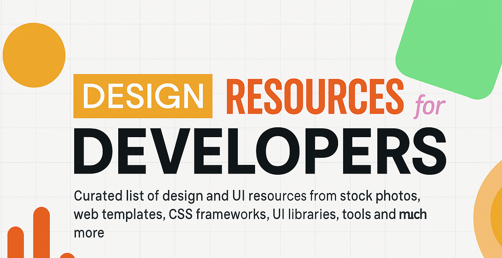

# 🎨 Awesome Design Resources - Part 1

> A comprehensive collection of design resources, tools, and assets for developers and designers. Everything you need to create stunning digital experiences.

#### 📖 Please read the [contributing guidelines](./contributing.md) before submitting new resources.

---

## Table of Contents

- [UI Graphics](#ui-graphics)
- [Fonts](#fonts)
- [Colors](#colors)
- [Icons](#icons)
- [Logos](#logos)
- [Favicons](#favicons)
- [Icon Fonts](#icon-fonts)
- [Stock Photos](#stock-photos)
- [Stock Videos](#stock-videos)
- [Stock Music & Sound Effects](#stock-music--sound-effects)
- [Vectors & Clip Art](#vectors--clip-art)
- [Product & Image Mockups](#product--image-mockups)
- [HTML & CSS Templates](#html--css-templates)
- [CSS Frameworks](#css-frameworks)
- [CSS Methodologies](#css-methodologies)
- [CSS Animations](#css-animations)
- [Javascript Animation Libraries](#javascript-animation-libraries)
- [Javascript Chart Libraries](#javascript-chart-libraries)
- [UI Components & Kits](#ui-components--kits)
- [React UI Libraries](#react-ui-libraries)
- [Vue UI Libraries](#vue-ui-libraries)
- [Angular UI Libraries](#angular-ui-libraries)
- [Svelte UI Libraries](#svelte-ui-libraries)
- [React Native UI Libraries](#react-native-ui-libraries)
- [Design Systems & Style Guides](#design-systems--style-guides)
- [Online Design Tools](#online-design-tools)
- [Downloadable Design Software](#downloadable-design-software)
- [Design Inspiration](#design-inspiration)
- [Image Compression](#image-compression)
- [Chrome Extensions](#chrome-extensions)
- [Firefox Extensions](#firefox-extensions)
- [AI Graphic Design Tools](#ai-graphic-design-tools)
- [Others](#others)

## 🎨 UI Graphics

> Modern UI components and graphics in various formats (PSD, Sketch, Figma) for web design inspiration

<table>
<tr>
<td width="25%"><strong>Website</strong></td>
<td width="25%"><strong>Website</strong></td>
<td width="25%"><strong>Website</strong></td>
<td width="25%"><strong>Website</strong></td>
</tr>
<tr>
<td><a href="https://uidesigndaily.com/"><strong>UI Design Daily</strong></a> Awesome UI components of all types</td>
<td><a href="https://www.humaaans.com/"><strong>Humaaans</strong></a> Cool people illustrations with mix & match</td>
<td><a href="https://undraw.co/"><strong>Undraw.co</strong></a> Open-source illustrations for any idea</td>
<td><a href="https://www.drawkit.io/"><strong>Drawkit.io</strong></a> Illustrations for designers and startups</td>
</tr>
<tr>
<td><a href="https://absurd.design/"><strong>Absurd.design</strong></a> Free surrealist illustrations</td>
<td><a href="https://www.manypixels.co/gallery/"><strong>Manypixels.co</strong></a> Monochromatic isometric illustrations</td>
<td><a href="https://www.openpeeps.com/"><strong>Open Peeps</strong></a> Hand drawn illustration library</td>
<td><a href="https://blush.design/"><strong>Blush</strong></a> Free customizable illustrations</td>
</tr>
<tr>
<td><a href="http://www.heropatterns.com/"><strong>Hero Patterns</strong></a> Repeatable SVG background patterns</td>
<td><a href="https://iradesign.io/"><strong>IRA Design</strong></a> Open-source gradient illustrations</td>
<td><a href="https://www.pixeltrue.com/illustrations"><strong>Pixeltrue</strong></a> Free animated illustrations</td>
<td><a href="https://2.flexiple.com/scale/all-illustrations"><strong>Flexiple</strong></a> One new illustration daily</td>
</tr>
<tr>
<td><a href="https://www.opendoodles.com/"><strong>Open Doodles</strong></a> Free set of sketchy illustrations</td>
<td><a href="https://avataaars.com/"><strong>Avataaars</strong></a> Free sketch library of avatars</td>
<td><a href="https://100dailyui.webflow.io/"><strong>100 Daily UI</strong></a> Free Figma library of products</td>
<td><a href="https://www.sketchappsources.com/"><strong>Sketch App Sources</strong></a> Sketch UIs, wireframes, icons</td>
</tr>
<tr>
<td><a href="https://patterns.beaubus.com/"><strong>BEAUBUS Patterns</strong></a> 150+ free SVG patterns</td>
<td><a href="https://www.transparenttextures.com/"><strong>Transparent Textures</strong></a> Transparent texture patterns</td>
<td><a href="https://icons8.com/illustrations"><strong>icons8 illustrations</strong></a> Vector illustrations for projects</td>
<td><a href="https://patternico.com"><strong>Patternico</strong></a> Seamless pattern maker</td>
</tr>
<tr>
<td><a href="https://www.abstractapi.com/user-avatar-api"><strong>Abstract User Avatar API</strong></a> API to create user avatars</td>
<td><a href="https://sketchvalley.com/"><strong>sketchvalley</strong></a> Download free PNG, SVG or AI files</td>
<td><a href="https://patternpad.com/"><strong>PatternPad</strong></a> Free unlimited pattern designs</td>
<td><a href="https://www.dimensions.com/"><strong>Dimensions</strong></a> Standard measurements database</td>
</tr>
<tr>
<td><a href="https://freebiesbug.com/"><strong>Freebiesbug</strong></a> Hand-picked design resources</td>
<td><a href="https://cooltext.com/"><strong>Cool Text</strong></a> FREE graphics generator for logos</td>
<td><a href="https://illustrationkit.com/"><strong>illustration kit</strong></a> Premium open source illustrations</td>
<td><a href="https://doodad.dev/pattern-generator/"><strong>Doodad Pattern Generator</strong></a> Create unique seamless patterns</td>
</tr>
<tr>
<td><a href="https://pattern.monster/"><strong>Pattern Monster</strong></a> Simple online pattern generator</td>
<td><a href="https://uibundle.com"><strong>UIBundle</strong></a> Thousands of free design resources</td>
<td><a href="http://openby.design/"><strong>openby.design</strong></a> Custom crafted free UI resources</td>
<td><a href="https://designstripe.com/catalog"><strong>Design Stripe</strong></a> Create beautiful illustrations easily</td>
</tr>
</table>

[🔝 Back to Top](#-table-of-contents)

---

## 🔤 Fonts

> Free fonts and typography tools for all your design projects

<table>
<tr>
<td width="25%"><strong>Website</strong></td>
<td width="25%"><strong>Website</strong></td>
<td width="25%"><strong>Website</strong></td>
<td width="25%"><strong>Website</strong></td>
</tr>
<tr>
<td><a href="https://fonts.google.com/"><strong>Google Fonts</strong></a> 1000+ free licensed font families</td>
<td><a href="https://www.dafont.com/"><strong>DaFont</strong></a> Archive of freely downloadable fonts</td>
<td><a href="https://usemodify.com/"><strong>Use & Modify</strong></a> Beautiful, classy, punk typefaces</td>
<td><a href="https://www.1001freefonts.com/"><strong>1001 Free Fonts</strong></a> Massive collection of free fonts</td>
</tr>
<tr>
<td><a href="https://www.fontsquirrel.com/"><strong>Font Squirrel</strong></a> High quality, legitimately free fonts</td>
<td><a href="https://www.fontfabric.com/free-fonts/"><strong>Font Fabric</strong></a> Digital type foundry crafting fonts</td>
<td><a href="https://justfreefonts.com/"><strong>Just Free Fonts</strong></a> Hand-curated commercial use collection</td>
<td><a href="https://fontjoy.com/"><strong>Fontjoy</strong></a> Generate font pairing in one click</td>
</tr>
<tr>
<td><a href="https://winniethemu.github.io/tiff/"><strong>Tiff</strong></a> Type diff tool for font comparison</td>
<td><a href="https://practice.typekit.com/"><strong>TypeKit Practice</strong></a> Learn about typography practices</td>
<td><a href="https://grtcalculator.com/"><strong>Golden Ratio</strong></a> Golden Ratio Typography Calculator</td>
<td><a href="https://www.fontget.com/"><strong>FontGet</strong></a> Variety of fonts with tags</td>
</tr>
<tr>
<td><a href="https://fontpair.co/"><strong>FontPair</strong></a> Helps pair Google Fonts together</td>
<td><a href="https://www.fontspace.com/"><strong>Font Space</strong></a> Designer-centered font website</td>
<td><a href="http://www.abstractfonts.com/"><strong>Abstract Fonts</strong></a> Fonts free for personal/commercial</td>
<td><a href="https://freetypography.com/"><strong>Free Typography</strong></a> List of high quality fonts</td>
</tr>
<tr>
<td><a href="https://github.com/cmiscm/leonsans/"><strong>Leon Sans</strong></a> Geometric typeface made with code</td>
<td><a href="https://www.lexend.com/"><strong>Lexend</strong></a> Variable font for improved reading</td>
<td><a href="https://fontflipper.com/"><strong>Font Flipper</strong></a> Preview 800+ Google Fonts on designs</td>
<td><a href="https://befonts.com/"><strong>Befonts</strong></a> High quality fonts for free</td>
</tr>
<tr>
<td><a href="https://fontsarena.com/"><strong>Fonts Arena</strong></a> Free curated fonts</td>
<td><a href="https://arabicfonts.net/"><strong>Arabic fonts</strong></a> Arabic fonts for free</td>
<td><a href="https://fontdrop.info"><strong>FontDrop</strong></a> Simple way to view font contents</td>
<td><a href="https://open-foundry.com"><strong>Open Foundry</strong></a> FREE curated open-source typefaces</td>
</tr>
<tr>
<td><a href="https://glyphter.com"><strong>Glyphter</strong></a> Upload SVGs and turn into fonts</td>
<td><a href="https://devfonts.gafi.dev/"><strong>Dev Fonts</strong></a> Find coding fonts for free</td>
<td><a href="https://fontm.com/"><strong>Font M</strong></a> Free fonts for coding and design</td>
<td><a href="https://www.fontshare.com/"><strong>Fontshare</strong></a> Quality fonts accessible to all</td>
</tr>
</table>

[🔝 Back to Top](#-table-of-contents)

---

## 🎨 Colors

> Color palettes, tools, and resources for perfect color combinations

<table>
<tr>
<td width="25%"><strong>Website</strong></td>
<td width="25%"><strong>Website</strong></td>
<td width="25%"><strong>Website</strong></td>
<td width="25%"><strong>Website</strong></td>
</tr>
<tr>
<td><a href="https://coolors.co"><strong>Coolors</strong></a> Perfect palette creator and inspiration</td>
<td><a href="https://color.adobe.com/create"><strong>Adobe Color</strong></a> Create palettes, extract gradients</td>
<td><a href="http://colormind.io"><strong>Colormind.io</strong></a> AI-powered color palette generator</td>
<td><a href="https://mycolor.space/"><strong>ColorSpace</strong></a> Generate palettes from one color</td>
</tr>
<tr>
<td><a href="https://flatuicolors.com"><strong>FlatUIColors</strong></a> Beautiful color palettes in various flavors</td>
<td><a href="https://colorhunt.co/"><strong>Color Hunt</strong></a> Thousands of trendy color palettes</td>
<td><a href="https://webgradients.com/"><strong>Web Gradients</strong></a> Free website for CSS gradients</td>
<td><a href="https://uicolors.app/create"><strong>UI Colors</strong></a> Tailwind CSS color palette generator</td>
</tr>
<tr>
<td><a href="https://www.happyhues.co/"><strong>Happyhues</strong></a> Color palette inspiration with examples</td>
<td><a href="https://gradienthunt.com/"><strong>Gradient Hunt</strong></a> Thousands of trendy color gradients</td>
<td><a href="http://khroma.co/"><strong>Khroma</strong></a> AI learns your colors, creates palettes</td>
<td><a href="https://colors.dopely.top/"><strong>colors.dopely</strong></a> Super-fast color palette generator</td>
</tr>
<tr>
<td><a href="https://htmlcolorcodes.com/"><strong>HTML Color Codes</strong></a> Get HTML color codes easily</td>
<td><a href="https://www.colorsandfonts.com/"><strong>Colors & Fonts</strong></a> Curated library of colors/fonts</td>
<td><a href="https://material.io/resources/color/"><strong>Google Material Color</strong></a> Official Material color tool</td>
<td><a href="https://www.materialpalette.com/"><strong>Material Palette</strong></a> Free Material Design palettes</td>
</tr>
<tr>
<td><a href="https://colorsinspo.com/"><strong>Colorsinspo</strong></a> All-in-one color resource</td>
<td><a href="https://colorswall.com/"><strong>ColorsWall</strong></a> Store palettes, generate quickly</td>
<td><a href="https://color.adobe.com/trends"><strong>Adobe Trends</strong></a> Discover current color trends</td>
<td><a href="https://www.colorbox.io"><strong>ColorBox</strong></a> Free website to produce color sets</td>
</tr>
<tr>
<td><a href="https://cssgradient.io/"><strong>CSS gradient</strong></a> Custom gradient maker</td>
<td><a href="https://gradienta.io/"><strong>gradienta</strong></a> Pure CSS and JPG gradients</td>
<td><a href="https://uigradients.com/"><strong>UI Gradients</strong></a> UI gradients color generator</td>
<td><a href="https://palettegenerator.colorion.co/"><strong>Palette Generator</strong></a> Generate new palette with spacebar</td>
</tr>
<tr>
<td><a href="https://www.grabient.com/"><strong>Grabient</strong></a> Gradient selector tool</td>
<td><a href="https://shadeswash.netlify.app/"><strong>ShadeSwash</strong></a> Generate shades of any color</td>
<td><a href="http://brandcolors.net/"><strong>BrandColors</strong></a> Official brand color codes</td>
<td><a href="https://brandpalettes.com/"><strong>BRAND PALETTES</strong></a> Logo color codes and palettes</td>
</tr>
<tr>
<td><a href="https://www.0to255.com/"><strong>0to255</strong></a> Easy color lightening/darkening</td>
<td><a href="https://whocanuse.com"><strong>whocanuse</strong></a> Color contrast accessibility tool</td>
<td><a href="https://colorable.jxnblk.com/"><strong>Colorable</strong></a> Color combination contrast tester</td>
<td><a href="https://colorhexpicker.com"><strong>Color Hex Picker</strong></a> Get hex code with color name</td>
</tr>
</table>

[🔝 Back to Top](#-table-of-contents)

---

## 🔗 Icons

> Free icons in various formats (SVG, PNG) for all your projects

<table>
<tr>
<td width="25%"><strong>Website</strong></td>
<td width="25%"><strong>Website</strong></td>
<td width="25%"><strong>Website</strong></td>
<td width="25%"><strong>Website</strong></td>
</tr>
<tr>
<td><a href="https://feathericons.com/"><strong>Feather Icons</strong></a> Beautiful customizable open source icons</td>
<td><a href="https://heroicons.dev/"><strong>Heroicons</strong></a> Free SVG icons from Tailwind CSS creators</td>
<td><a href="https://tabler-icons.io/"><strong>Tabler Icons</strong></a> 3500+ customizable open source SVG icons</td>
<td><a href="https://simpleicons.org/"><strong>Simple Icons</strong></a> 1300+ free SVG icons for popular brands</td>
</tr>
<tr>
<td><a href="https://linearicons.com/free"><strong>Linear Icons</strong></a> 1000+ ultra crisp vector icons</td>
<td><a href="https://icons8.com/"><strong>Icons8</strong></a> Free icons, photos, vectors and tools</td>
<td><a href="https://www.flaticon.com/"><strong>Flat Icon</strong></a> Largest database of free icons in PNG, SVG</td>
<td><a href="https://thenounproject.com/"><strong>The Noun Project</strong></a> Over 2 Million curated icons</td>
</tr>
<tr>
<td><a href="https://iconscout.com/"><strong>Iconscout</strong></a> Free Download Icons illustrations</td>
<td><a href="https://iconsear.ch/search.html"><strong>IconSear.ch</strong></a> Search engine with over 50,000 SVG icons</td>
<td><a href="https://nucleoapp.com/"><strong>Nucleo App</strong></a> Library of 27500 icons and application</td>
<td><a href="https://icon-icons.com/"><strong>Icon-icons.com</strong></a> Free Icons PNG, ICO, ICNS and Vector SVG</td>
</tr>
<tr>
<td><a href="https://icons.getbootstrap.com/"><strong>Bootstrap Icons</strong></a> Free Icons built for Bootstrap</td>
<td><a href="https://remixicon.com/"><strong>Remix Icon</strong></a> Simply Delightful Icon System</td>
<td><a href="https://iconmonstr.com/"><strong>Iconmonstr</strong></a> Discover 4496+ free icons in collections</td>
<td><a href="https://webkul.github.io/vivid/"><strong>Vivid.js</strong></a> Free SVG Icons Pack JavaScript Library</td>
</tr>
<tr>
<td><a href="https://www.iconfinder.com/"><strong>Iconfinder</strong></a> Free and premium vector icons</td>
<td><a href="https://lordicon.com/icons#free"><strong>Lordicon</strong></a> 50 free animated interactive icons</td>
<td><a href="https://useanimations.com/"><strong>UseAnimations</strong></a> Free Animated Icons in SVG and Json</td>
<td><a href="https://css.gg/"><strong>css.gg</strong></a> 700+ Open-source CSS, SVG and Figma icons</td>
</tr>
<tr>
<td><a href="https://www.iconbros.com"><strong>IconBros</strong></a> 7843+ free icons grouped in collections</td>
<td><a href="https://materialdesignicons.com/"><strong>Material Design Icons</strong></a> Icon collection for various platforms</td>
<td><a href="https://www.zondicons.com/icons.html"><strong>Zondicons</strong></a> Set of free premium SVG icons</td>
<td><a href="http://endlessicons.com/"><strong>Endless Icons</strong></a> Website offering free icons</td>
</tr>
<tr>
<td><a href="https://icomoon.io/app/"><strong>Icomoon</strong></a> Browse 5500+ Free Icons</td>
<td><a href="https://akveo.github.io/eva-icons/#/"><strong>Eva Icons</strong></a> 480+ beautifully crafted Open Source icons</td>
<td><a href="http://cryptoicons.co/"><strong>Cryptoicons</strong></a> 430 crypto and fiat currency icons</td>
<td><a href="https://ikonate.com/"><strong>Ikonate</strong></a> Fully customizable & accessible vector icons</td>
</tr>
<tr>
<td><a href="https://appicon.co/"><strong>appicon</strong></a> Generate app icons for iOS, macOS and Android</td>
<td><a href="https://lineicons.com"><strong>LineIcons</strong></a> 2000+ Essential Line Icons for Designers</td>
<td><a href="https://www.svgrepo.com/"><strong>SVG Repo</strong></a> Download free SVG Vectors for commercial use</td>
<td><a href="https://cssicon.space/"><strong>CSS ICON</strong></a> Icon set made with pure css code</td>
</tr>
<tr>
<td><a href="https://iconify.design/"><strong>Unified icons</strong></a> Thousands of icons, one unified framework</td>
<td><a href="https://systemuicons.com/"><strong>System UIcons</strong></a> 220+ icons in a growing collection</td>
<td><a href="https://www.radix-ui.com/icons"><strong>Radix Icons</strong></a> Crisp set of 15×15 icons</td>
<td><a href="https://icons.eosdesignsystem.com/"><strong>EOS Icons</strong></a> Pixel-perfect, open source iconic font</td>
</tr>
<tr>
<td><a href="https://ionicons.com"><strong>Ionicons</strong></a> Beautiful crafted open source icons</td>
<td><a href="https://phosphoricons.com"><strong>Phosphor Icons</strong></a> Flexible icon family for interfaces</td>
<td><a href="https://teenyicons.com/"><strong>Teeny Icons</strong></a> Set of icons in SVG format easy to use</td>
<td><a href="https://lucide.netlify.app/"><strong>Lucide</strong></a> Open-source icon library</td>
</tr>
<tr>
<td><a href="https://icones.js.org/"><strong>Icones</strong></a> Icon Explorer with Instant searching</td>
<td><a href="https://shittyicons.com/"><strong>Shitty Icons</strong></a> Collection of Free icons</td>
<td><a href="https://www.iconspedia.com/"><strong>Iconspedia</strong></a> Large collection of high quality free icons</td>
<td><a href="https://iconhub.io/"><strong>iconhub</strong></a> Just practical stunning icons for everyone</td>
</tr>
<tr>
<td><a href="https://3dicons.co"><strong>3DICONS</strong></a> Beautifully crafted open source 3D icons</td>
<td><a href="https://www.iconsdb.com/"><strong>IconsDb</strong></a> Free Custom Icons</td>
<td><a href="https://emojiguide.org/"><strong>Emoji Guide</strong></a> 3300 emojis with their HTML codes</td>
<td><a href="https://unicornicons.com"><strong>Unicorn Icons</strong></a> 100+ customizable playful animated icons</td>
</tr>
<tr>
<td><a href="https://sargamicons.com/"><strong>Sargam Icons</strong></a> 275+ open-source icons</td>
<td><a href="https://iconbuddy.app/"><strong>Icon buddy</strong></a> 100K+ open-source SVG icons</td>
<td><a href="https://roundicons.com/"><strong>Round Icons</strong></a> World's biggest premium and free icon library</td>
<td><a href="https://vectopus.com"><strong>Vectopus</strong></a> Top curated collective resources</td>
</tr>
</table>

[🔝 Back to Top](#-table-of-contents)

---

## 🏷️ Logos

> Logo resources and brand identity assets

<table>
<tr>
<td width="25%"><strong>Website</strong></td>
<td width="25%"><strong>Website</strong></td>
<td width="25%"><strong>Website</strong></td>
<td width="25%"><strong>Website</strong></td>
</tr>
<tr>
<td><a href="https://logosear.ch/search.html"><strong>LogoSear.ch</strong></a> Search engine with over 200,000 SVG logos</td>
<td><a href="https://svgporn.com"><strong>SVGPorn</strong></a> 1000+ high-quality SVG logos</td>
<td><a href="https://github.com/mpay24/payment-logos/"><strong>Payment System Logos</strong></a> Logos for payment systems in png and svg</td>
<td><a href="https://github.com/alrra/browser-logos/"><strong>Browser Logos</strong></a> High resolution web browser logos</td>
</tr>
<tr>
<td><a href="https://www.vectorlogo.zone/"><strong>VectorLogoZone</strong></a> Consistently formatted SVG logos</td>
<td><a href="https://worldvectorlogo.com/"><strong>World Vector Logo</strong></a> Download vector logos of brands you love</td>
<td><a href="https://logomakr.com/"><strong>Logo Maker</strong></a> Create custom logos</td>
<td><a href="https://www.namecheap.com/logo-maker/"><strong>Free Logo Maker</strong></a> Fast, All-in-One Logo Generator</td>
</tr>
<tr>
<td><a href="https://www.logo.wine/"><strong>LOGOwine</strong></a> Brand Logos Free Download in SVG & PNG</td>
<td></td>
<td></td>
<td></td>
</tr>
</table>

[🔝 Back to Top](#-table-of-contents)

---

## 🔖 Favicons

> Tools and resources for creating website favicons

<table>
<tr>
<td width="25%"><strong>Website</strong></td>
<td width="25%"><strong>Website</strong></td>
<td width="25%"><strong>Website</strong></td>
<td width="25%"><strong>Website</strong></td>
</tr>
<tr>
<td><a href="https://faviconforge.io/"><strong>FaviconForge</strong></a> Very simple favicon generator. Download in .ico and .png formats</td>
<td><a href="https://favicon.io/"><strong>Favicon.io</strong></a> Generate a favicon from text, from an image, or from an emoji</td>
<td><a href="https://favicomatic.com/"><strong>Favicomatic</strong></a> Generate favicons of all the sizes and formats</td>
<td><a href="http://tools.dynamicdrive.com/favicon/"><strong>Favicon Generator</strong></a> Generate favicon ico files for your website</td>
</tr>
<tr>
<td><a href="https://realfavicongenerator.net/"><strong>RealFaviconGenerator</strong></a> Generate icons for all platforms (Windows, iOS, Android)</td>
<td><a href="https://gauger.io/fonticon/"><strong>FontIcon</strong></a> Generate favicons and images from Font Awesome icons</td>
<td><a href="https://www.favicon.cc"><strong>Favicon.cc</strong></a> Draw a favicon online and browse through a library</td>
<td><a href="https://maskable.app/editor/"><strong>Maskable.app Editor</strong></a> Generate maskable PWA icons based on your existing icon</td>
</tr>
<tr>
<td><a href="https://favicon.inbrowser.app/"><strong>Favicon Generator</strong></a> Generate website's favicon assets. SVG, maskable, image minified supported</td>
<td><a href="https://favifiles.com/"><strong>FaviFiles</strong></a> Generate pixel-perfect favicons for free in seconds</td>
<td></td>
<td></td>
</tr>
</table>

[🔝 Back to Top](#-table-of-contents)

## 📸 Stock Photos

> High-quality free stock photography for your projects

<table>
<tr>
<td width="25%"><strong>Website</strong></td>
<td width="25%"><strong>Website</strong></td>
<td width="25%"><strong>Website</strong></td>
<td width="25%"><strong>Website</strong></td>
</tr>
<tr>
<td><a href="https://www.pexels.com/"><strong>Pexels</strong></a> Free stock photos shared by talented creators</td>
<td><a href="https://unsplash.com/"><strong>Unsplash</strong></a> The internet's source of freely usable images</td>
<td><a href="https://pixabay.com/"><strong>Pixabay</strong></a> Over 1.7 million+ high-quality stock images</td>
<td><a href="https://magdeleine.co/"><strong>Magdeleine</strong></a> Gallery & free high-resolution photo everyday</td>
</tr>
<tr>
<td><a href="https://picspree.com"><strong>Picspree</strong></a> Royalty free images, stock photos, illustrations</td>
<td><a href="https://burst.shopify.com/"><strong>Burst</strong></a> Free stock photos collections</td>
<td><a href="https://gratisography.com/"><strong>Gratisography</strong></a> Free collection of free high-resolution pictures</td>
<td><a href="https://www.lifeofpix.com/"><strong>Life of Pix</strong></a> Free high-resolution photography</td>
</tr>
<tr>
<td><a href="https://stocksnap.io/"><strong>Stock Snap</strong></a> Hundreds of high quality photos added weekly</td>
<td><a href="https://morguefile.com/"><strong>Morguefile</strong></a> Over 350,000 free stock photos</td>
<td><a href="https://kaboompics.com/"><strong>Kaboom Pics</strong></a> Stock photography and color palettes</td>
<td><a href="https://nos.twnsnd.co/"><strong>New Old Stock</strong></a> Stock vintage photos</td>
</tr>
<tr>
<td><a href="https://picjumbo.com/"><strong>Pic Jumbo</strong></a> Good collections of different types of photos</td>
<td><a href="https://www.publicdomainpictures.net/"><strong>Public Domain Pictures</strong></a> Public domain images of all types</td>
<td><a href="https://www.chamberofcommerce.org/findaphoto/"><strong>Find A Photo</strong></a> Searches multiple stock photo websites</td>
<td><a href="http://www.stockvault.net/"><strong>Stockvault</strong></a> Categorized stock photos</td>
</tr>
<tr>
<td><a href="https://placeholder.com/"><strong>Placeholder</strong></a> Free image placeholder service for the web</td>
<td><a href="https://realisticshots.com/"><strong>Realistic Shots</strong></a> Free high-resolution stock photos</td>
<td><a href="https://negativespace.co/"><strong>Negative Space</strong></a> High-Resolution Free Stock Photos</td>
<td><a href="https://skitterphoto.com/"><strong>SkitterPhoto</strong></a> Free high-resolution photography</td>
</tr>
<tr>
<td><a href="https://picography.co/"><strong>PicoGraphy</strong></a> Gorgeous, High-Resolution, Free Photos</td>
<td><a href="https://wunderstock.com/"><strong>Wunder Stock</strong></a> Stunningly amazing free photos</td>
<td><a href="https://pxhere.com/"><strong>PxHere</strong></a> Free Images & Free stock photos</td>
<td><a href="https://piqsels.com/"><strong>Piqsels</strong></a> Royalty Free Stock Photos</td>
</tr>
<tr>
<td><a href="https://www.foodiesfeed.com/"><strong>FoodiesFeed</strong></a> Food photo stock</td>
<td><a href="https://www.nappy.co/"><strong>Nappy</strong></a> Beautiful, high-res photos of black and brown people</td>
<td><a href="https://generated.photos/"><strong>Generated Photos</strong></a> Unique AI Generated model photos</td>
<td><a href="https://www.reshot.com/"><strong>Reshot</strong></a> Uniquely free photos. Handpicked, non-stocky images</td>
</tr>
<tr>
<td><a href="https://www.freeimages.com/"><strong>Free Images</strong></a> Find and download free stock photos</td>
<td><a href="https://picsum.photos/"><strong>Lorem Picsum</strong></a> Easy to use API to get beautiful placeholder images</td>
<td><a href="https://www.scienceimage.csiro.au"><strong>scienceimage</strong></a> Image library specializing in science and nature</td>
<td><a href="https://ian.umces.edu/imagelibrary"><strong>Integration & Application Network</strong></a> Free images for science communication</td>
</tr>
<tr>
<td><a href="http://www.freenatureimages.eu"><strong>Saxifraga</strong></a> Free nature images</td>
<td><a href="https://search.creativecommons.org"><strong>Creative Commons</strong></a> Search for free images to reuse</td>
<td><a href="https://allthefreestock.com/"><strong>AllTheFreeStock</strong></a> Curated list of free stock images, audio and videos</td>
<td><a href="https://lorem.space"><strong>Lorem.space</strong></a> API for placeholder images</td>
</tr>
<tr>
<td><a href="https://wordpress.org/openverse/"><strong>Openverse</strong></a> Search engine for openly-licensed media</td>
<td><a href="https://isorepublic.com/"><strong>ISO Republic</strong></a> Thousands of Free High-Resolution Stock CC0 Photos</td>
<td></td>
<td></td>
</tr>
</table>

[🔝 Back to Top](#-navigation)

---

## 🎬 Stock Videos

> Websites that offer free stock videos for your projects

<table>
<tr>
<td width="25%"><strong>Website</strong></td>
<td width="25%"><strong>Website</strong></td>
<td width="25%"><strong>Website</strong></td>
<td width="25%"><strong>Website</strong></td>
</tr>
<tr>
<td><a href="https://www.pexels.com/videos"><strong>Pexels</strong></a> Largest library of free to use videos</td>
<td><a href="https://www.pixabay.com/videos"><strong>Pixabay</strong></a> Large library of free to use videos</td>
<td><a href="https://coverr.co/"><strong>Coverr.co</strong></a> Beautiful free stock video footage</td>
<td><a href="https://www.videezy.com/"><strong>Videezy</strong></a> Free HD stock footage & 4K videos</td>
</tr>
<tr>
<td><a href="https://mixkit.co/"><strong>Mix Kit</strong></a> Stock video clips & music</td>
<td><a href="https://www.lifeofvids.com/"><strong>Life Of Vids</strong></a> Free video clips and loops</td>
<td><a href="https://www.videvo.net/stock-video-footage/"><strong>Videvo</strong></a> Free and premium stock videos</td>
<td><a href="http://stock.loopvidz.com/"><strong>Loopvidz</strong></a> Free To Use Cinema graphs Created With VIMAGE App</td>
</tr>
<tr>
<td><a href="https://www.splitshire.com/"><strong>SplitShire</strong></a> Beautiful & exclusive free stock videos & photos</td>
<td><a href="https://free-stock.video"><strong>Free-Stock-Video</strong></a> Free Footage Stock Videos</td>
<td></td>
<td></td>
</tr>
</table>

[🔝 Back to Top](#-navigation)

---

## 🎵 Stock Music & Sound Effects

> Websites that offer free stock music and/or sound effects

<table>
<tr>
<td width="25%"><strong>Website</strong></td>
<td width="25%"><strong>Website</strong></td>
<td width="25%"><strong>Website</strong></td>
<td width="25%"><strong>Website</strong></td>
</tr>
<tr>
<td><a href="https://www.youtube.com/audiolibrary"><strong>YouTube Studio Audio Library</strong></a> Royalty-free audio library for downloadable music</td>
<td><a href="https://www.free-stock-music.com/"><strong>Free Stock Music</strong></a> Royalty free stock music for YouTube videos</td>
<td><a href="https://www.bensound.com/"><strong>Bensound</strong></a> Download Royalty Free Music for free</td>
<td><a href="https://mixkit.co/free-stock-music/"><strong>Mixkit</strong></a> Free music for your projects</td>
</tr>
<tr>
<td><a href="https://freesound.org/"><strong>Freesound</strong></a> Free stock music and sounds</td>
<td><a href="https://freemusicarchive.org/"><strong>Free Music Archive</strong></a> Collaborative database of creative-commons licensed sound</td>
<td><a href="https://musopen.org/music/"><strong>Musopen</strong></a> An online copyright free classical music library</td>
<td><a href="https://pixabay.com/music/"><strong>Pixabay</strong></a> Free music downloads for your project</td>
</tr>
<tr>
<td><a href="https://www.unminus.com/"><strong>Unminus</strong></a> Free Premium Music for Your Projects</td>
<td></td>
<td></td>
<td></td>
</tr>
</table>

[🔝 Back to Top](#-navigation)

---

## 🎨 Vectors & Clip Art

> Free vectors, clipart, illustrations, patterns and more

<table>
<tr>
<td width="25%"><strong>Website</strong></td>
<td width="25%"><strong>Website</strong></td>
<td width="25%"><strong>Website</strong></td>
<td width="25%"><strong>Website</strong></td>
</tr>
<tr>
<td><a href="https://pngfree.ai/"><strong>PNGFree.ai</strong></a> Millions of high-quality Free PNG images</td>
<td><a href="https://www.vecteezy.com/"><strong>Vecteezy</strong></a> Find and download free vector art</td>
<td><a href="https://www.freepik.com"><strong>Freepik</strong></a> Free vectors, stock photos, PSD and icons</td>
<td><a href="https://www.freevectors.net/"><strong>Free Vectors</strong></a> Community of vector lovers who share free graphics</td>
</tr>
<tr>
<td><a href="https://pngtree.com/free-vectors"><strong>PNGTree</strong></a> png, backgrounds, templates, text effects</td>
<td><a href="https://www.vector4free.com/"><strong>Vector4Free</strong></a> Free vector graphics</td>
<td><a href="http://freebbble.com/"><strong>Freeble</strong></a> Vectors, patterns, mockups and more</td>
<td><a href="https://lukaszadam.com/"><strong>Lukaszadam</strong></a> Free Vector artworks</td>
</tr>
<tr>
<td><a href="https://illlustrations.co/"><strong>Illlustrations</strong></a> Beautiful 100 Illustrations - png, svg</td>
<td><a href="https://www.clipart.email/"><strong>Clipart</strong></a> Great clipart, png, coloring pages, drawings</td>
<td><a href="https://growwwkit.com/illustrations/phonies"><strong>Growwwkit illustrations</strong></a> 8 simple, black & white, stylish illustrations</td>
<td><a href="https://trianglify.io/"><strong>trianglify.io</strong></a> Generate low-poly backgrounds, textures, and vectors</td>
</tr>
<tr>
<td><a href="https://blobs.app/"><strong>blob</strong></a> Generate Blob shapes for Web and Flutter apps</td>
<td><a href="https://www.hiclipart.com/"><strong>HiClipart</strong></a> Community for designers to share transparent PNGs</td>
<td><a href="https://stories.freepik.com/"><strong>Stories by Freepik</strong></a> Collection of free and customizable illustrations</td>
<td><a href="https://www.blackillustrations.com/"><strong>Black Illustrations</strong></a> Beautiful illustrations of black people</td>
</tr>
<tr>
<td><a href="https://delesign.com/free-designs/graphics"><strong>Delesign</strong></a> Collection of free illustrations and more</td>
<td><a href="https://www.shapedivider.app/"><strong>Custom Shape Dividers</strong></a> Free tool to export beautiful SVG shape divider</td>
<td><a href="https://smart.servier.com"><strong>Servier Medical Art</strong></a> 3000 free medical images to illustrate your publications</td>
<td><a href="http://www.clker.com"><strong>Clker</strong></a> Free clip art you can use for anything you like</td>
</tr>
<tr>
<td><a href="https://svgwave.in/"><strong>SVG wave</strong></a> Free, customizable gradient SVG wave generator</td>
<td><a href="https://bgjar.com"><strong>BGjar</strong></a> Free svg background generator for websites</td>
<td><a href="https://www.heritagetype.com/collections/free-vintage-illustrations"><strong>Heritage Library</strong></a> Vintage Illustrations (vector and png)</td>
<td><a href="https://robohash.org/"><strong>ROBOHASH</strong></a> Generate unique images from any text</td>
</tr>
<tr>
<td><a href="https://tabbied.com/"><strong>Tabbied</strong></a> Create and customize minimally generated patterns</td>
<td><a href="https://app.haikei.app/"><strong>Haikei</strong></a> An awesome multishape web app</td>
<td><a href="https://vector.ma/"><strong>Vector</strong></a> Awesome website for all kinds of Moroccan vectors</td>
<td><a href="https://app.heazy.studio/"><strong>Heazy</strong></a> Unique vector assets within seconds</td>
</tr>
<tr>
<td><a href="https://mossaik.app/"><strong>Mossaik</strong></a> Free SVG generator with different tools</td>
<td></td>
<td></td>
<td></td>
</tr>
</table>

[🔝 Back to Top](#-navigation)

---

## 📱 Product & Image Mockups

> Create mockups of devices and other products

<table>
<tr>
<td width="25%"><strong>Website</strong></td>
<td width="25%"><strong>Website</strong></td>
<td width="25%"><strong>Website</strong></td>
<td width="25%"><strong>Website</strong></td>
</tr>
<tr>
<td><a href="https://mockcity.com/"><strong>MockCity</strong></a> Bulk generate mockups from PSD templates</td>
<td><a href="https://smartmockups.com/"><strong>Smart Mockups</strong></a> Create stunning product mockups (free & premium)</td>
<td><a href="https://mediamodifier.com/"><strong>Media Modifier</strong></a> Beautiful design mockups service for your products</td>
<td><a href="https://shotsnapp.com/"><strong>Shot Snap</strong></a> Create beautiful device mockup images</td>
</tr>
<tr>
<td><a href="https://www.screely.com/"><strong>Screely</strong></a> Instantly turn your screenshot into a mockup</td>
<td><a href="https://screenshot.rocks/"><strong>Screenshot.rocks</strong></a> Create beautiful browser & mobile mockups</td>
<td><a href="https://screenpeek.io/"><strong>Screen Peak</strong></a> Create a mockup from a URL</td>
<td><a href="https://www.mockupworld.co/"><strong>Mockup World</strong></a> The biggest source of free photo-realistic Mockups</td>
</tr>
<tr>
<td><a href="https://www.collabshot.com/"><strong>Collab Shot</strong></a> Real-time screen grabs and image sharing</td>
<td><a href="https://facebook.design/devices"><strong>Facebook Devices</strong></a> Images and Sketch files of popular devices</td>
<td><a href="https://threed.io"><strong>Threed.io</strong></a> Generate 3D mockups right in your browser</td>
<td><a href="https://mockuphone.com/"><strong>Mockuphone</strong></a> 100% free mockups for all devices</td>
</tr>
<tr>
<td><a href="https://deviceshots.com/"><strong>Device Shots</strong></a> Create high-resolution device mockups</td>
<td><a href="https://cleanmock.com/"><strong>Clean Mock</strong></a> Create stunning mockups using latest device frames</td>
<td><a href="https://www.mock.video/"><strong>Mock.Video</strong></a> Instantly create mockups by adding a device frame</td>
<td><a href="https://mockupbro.com/"><strong>MockupBro</strong></a> Create product mockups with online generator</td>
</tr>
<tr>
<td><a href="https://github.com/alyssaxuu/animockup"><strong>Animockup</strong></a> Create animated mockups in the browser</td>
<td><a href="https://pika.style"><strong>Pika</strong></a> Instantly create browser mockups and beautiful images</td>
<td><a href="https://icons8.com/lunacy"><strong>Lunacy</strong></a> Create mockups from scratch for free</td>
<td></td>
</tr>
</table>

[🔝 Back to Top](#-navigation)

---

## 🌐 HTML & CSS Templates

> Websites that offer free beautiful website templates and themes

<table>
<tr>
<td width="25%"><strong>Website</strong></td>
<td width="25%"><strong>Website</strong></td>
<td width="25%"><strong>Website</strong></td>
<td width="25%"><strong>Website</strong></td>
</tr>
<tr>
<td><a href="https://html5up.net/"><strong>HTML5Up</strong></a> Very modern, unique responsive HTML5/CSS3 themes</td>
<td><a href="https://templatemo.com/"><strong>Templatemo</strong></a> Minimal, resume, gallery themes and more</td>
<td><a href="https://freehtml5.co/"><strong>FreeHTML5</strong></a> Free & premium HTML5 and Bootstrap themes</td>
<td><a href="https://www.styleshout.com/free-templates/"><strong>StyleShout</strong></a> Brilliantly crafted free website templates</td>
</tr>
<tr>
<td><a href="https://startbootstrap.com/"><strong>Start Bootstrap</strong></a> Bootstrap starter themes</td>
<td><a href="https://themewagon.com/theme-price/free/"><strong>ThemeWagon</strong></a> Collection of HTML5 Bootstrap templates</td>
<td><a href="https://colorlib.com/wp/templates/"><strong>Colorlib</strong></a> Almost any category of theme you can think of</td>
<td><a href="https://www.free-css.com/free-css-templates"><strong>Free CSS</strong></a> Huge collection of free templates</td>
</tr>
<tr>
<td><a href="https://www.hubspot.com/resources"><strong>Hubspot</strong></a> Templates, infographics, banners and much more</td>
<td><a href="https://mobirise.com/html-templates/"><strong>Mobirise</strong></a> Great looking HTML5/CSS3 templates</td>
<td><a href="https://bootswatch.com/"><strong>Bootswatch</strong></a> Free themes for Bootstrap</td>
<td><a href="https://onepagelove.com/"><strong>Onepagelove</strong></a> One-page websites, templates and resources</td>
</tr>
<tr>
<td><a href="https://themesfor.app/"><strong>Themes For App</strong></a> Free Bootstrap themes and landing pages</td>
<td><a href="https://bootstraptaste.com/"><strong>BootstrapTaste</strong></a> Premium & Free Bootstrap Templates</td>
<td><a href="https://bootstrapmade.com/"><strong>BootstrapMade</strong></a> Elegant, clean and beautiful free templates</td>
<td><a href="https://w3layouts.com/"><strong>W3Layouts</strong></a> 3784+ Free Website Templates for 2020</td>
</tr>
<tr>
<td><a href="https://www.tooplate.com/"><strong>Tooplate</strong></a> Free HTML Templates for everyone!</td>
<td><a href="https://cruip.com/free-templates/"><strong>Cruip</strong></a> Fully coded HTML templates to help you build</td>
<td><a href="https://uideck.com/"><strong>UIdeck</strong></a> Free Landing Page Templates and Bootstrap Themes</td>
<td><a href="https://splawr.com/"><strong>Splawr</strong></a> Free web templates to kickstart your idea!</td>
</tr>
<tr>
<td><a href="https://www.w3schools.com/w3css/w3css_templates.asp"><strong>W3css_templates</strong></a> Some responsive W3.CSS website templates</td>
<td><a href="https://all-free-download.com/free-website-templates/free-html-css-templates.html"><strong>All-Free-Download</strong></a> Download free-website-templates</td>
<td><a href="http://www.mashup-template.com/templates.html"><strong>mashup-template</strong></a> HTML5/CSS3 Free Templates</td>
<td><a href="https://github.com/themeselection/sneat-html-admin-template-free"><strong>Sneat Bootstrap 5</strong></a> Open-source & Easy to use Bootstrap 5 Template</td>
</tr>
<tr>
<td><a href="https://htmlrev.com"><strong>HTMLrev</strong></a> Free beautiful HTML5 templates and landing pages</td>
<td><a href="https://horizon-ui.com/"><strong>Horizon UI</strong></a> Trendiest open source Admin Template for React</td>
<td><a href="https://keenthemes.com/"><strong>KeenThemes</strong></a> Free and Pro Html/Css3, Bootstrap5 templates</td>
<td><a href="https://github.com/mearashadowfax/ScrewFast"><strong>ScrewFast</strong></a> Open-source Astro website template</td>
</tr>
</table>

[🔝 Back to Top](#-navigation)

---

## 🎛️ CSS Frameworks

> CSS/UI frameworks to help build great looking websites and applications

<table>
<tr>
<td width="25%"><strong>Website</strong></td>
<td width="25%"><strong>Website</strong></td>
<td width="25%"><strong>Website</strong></td>
<td width="25%"><strong>Website</strong></td>
</tr>
<tr>
<td><a href="https://tailwindcss.com/"><strong>Tailwind CSS</strong></a> Low level, utility-first framework</td>
<td><a href="https://getbootstrap.com/"><strong>Bootstrap</strong></a> Popular UI framework with tons of components</td>
<td><a href="https://materializecss.com/"><strong>Materialize</strong></a> A modern responsive front-end framework</td>
<td><a href="https://getmdl.io/"><strong>Material Design Lite</strong></a> Light framework based on Material Design</td>
</tr>
<tr>
<td><a href="https://bulma.io/"><strong>Bulma</strong></a> Modern CSS framework with no JS</td>
<td><a href="http://getskeleton.com/"><strong>Skeleton</strong></a> Extremely light framework for basic UI elements</td>
<td><a href="https://uniformcss.com/"><strong>Uniform CSS</strong></a> Fully configurable utility generator and CSS framework</td>
<td><a href="https://semantic-ui.com/"><strong>Semantic UI</strong></a> Empowers designers and developers by creating shared vocabulary</td>
</tr>
<tr>
<td><a href="https://fomantic-ui.com/"><strong>Fomantic UI</strong></a> A community fork of Semantic-UI</td>
<td><a href="https://get.foundation/"><strong>Foundation</strong></a> Mobile first framework with clean markup</td>
<td><a href="https://purecss.io/"><strong>Pure CSS</strong></a> A set of small, responsive CSS modules</td>
<td><a href="https://getuikit.com/"><strong>UIKit</strong></a> Lightweight and modular front-end framework</td>
</tr>
<tr>
<td><a href="https://www.oddbird.net/susy/"><strong>Susy</strong></a> Lightweight, grid-layout engine for Sass</td>
<td><a href="https://milligram.io/"><strong>Milligram.io</strong></a> Minimalist CSS framework</td>
<td><a href="https://vanillaframework.io/"><strong>Vanilla Framework</strong></a> Simple, extensible CSS framework written in Sass</td>
<td><a href="https://picturepan2.github.io/spectre/"><strong>Spectre CSS</strong></a> Lightweight, modern CSS framework</td>
</tr>
<tr>
<td><a href="https://picnicss.com/"><strong>Picnic CSS</strong></a> Lightweight and beautiful library</td>
<td><a href="https://kbrsh.github.io/wing/"><strong>Wing</strong></a> A beautiful CSS framework designed for minimalists</td>
<td><a href="https://jenil.github.io/chota/"><strong>Chota</strong></a> A micro (~3kb) CSS framework</td>
<td><a href="https://blueprintcss.dev/"><strong>Blueprint CSS</strong></a> A lightweight layout library for building responsive UIs</td>
</tr>
<tr>
<td><a href="https://www.w3schools.com/w3css/"><strong>W3.CSS</strong></a> A modern CSS framework with support for all devices</td>
<td><a href="https://jdan.github.io/98.css/"><strong>98.css</strong></a> A design system for building faithful recreations of old UIs</td>
<td><a href="https://nostalgic-css.github.io/NES.css/"><strong>NES CSS</strong></a> NES-style CSS Framework</td>
<td><a href="https://www.shoelace.style/"><strong>Shoelace.css</strong></a> Lightweight, forward-thinking CSS library</td>
</tr>
<tr>
<td><a href="https://andybrewer.github.io/mvp/"><strong>MVP.css</strong></a> A minimalist stylesheet for HTML elements</td>
<td><a href="http://blazecss.com/"><strong>Blaze.css</strong></a> Open source modular CSS toolkit</td>
<td><a href="https://turretcss.com/"><strong>Turret CSS</strong></a> Turret CSS is a styles framework for development</td>
<td><a href="https://www.cutestrap.com/"><strong>Cutestrap</strong></a> A strong, independent CSS Framework</td>
</tr>
<tr>
<td><a href="https://botoxparty.github.io/XP.css/"><strong>XP.css</strong></a> XP.css is an extension of 98.css</td>
<td><a href="https://framework7.io/"><strong>Framework7</strong></a> Free and open source framework to develop mobile apps</td>
<td><a href="https://kushagra.dev/lab/hint/"><strong>Hint.css</strong></a> A pure CSS tooltip library for websites</td>
<td><a href="http://imagehover.io/"><strong>imagehover.io</strong></a> Pure CSS Image Hover Effect Library</td>
</tr>
<tr>
<td><a href="https://minicss.org/"><strong>mini.css</strong></a> A minimal, responsive, style-agnostic CSS framework</td>
<td><a href="https://tachyons.io/"><strong>Tachyons</strong></a> Create fast loading, highly readable interfaces</td>
<td><a href="https://fezvrasta.github.io/bootstrap-material-design/"><strong>Material Bootstrap</strong></a> Material Design with Bootstrap</td>
<td><a href="https://github.com/IVORY-UI/ivory"><strong>Ivory</strong></a> A modern CSS framework for developing powerful interfaces</td>
</tr>
<tr>
<td><a href="https://www.gethalfmoon.com/"><strong>Halfmoon UI</strong></a> A responsive and lightweight framework for dashboards</td>
<td><a href="https://metroui.org.ua/index.html"><strong>Metro 4</strong></a> Create your site quickly with impressive components</td>
<td><a href="https://css-doodle.com/"><strong>css-doodle</strong></a> A web component for drawing patterns with CSS</td>
<td><a href="https://latex.now.sh/"><strong>latex.css</strong></a> Make your website look like a LaTeX document</td>
</tr>
<tr>
<td><a href="https://github.com/cognitom/paper-css"><strong>Paper CSS</strong></a> Front-end printing solution</td>
<td><a href="https://windicss.org/"><strong>Windi CSS</strong></a> Next generation compiler for Tailwind CSS</td>
<td><a href="https://cirrus-ui.netlify.app/"><strong>Cirrus CSS</strong></a> A component and utility centric SCSS framework</td>
<td><a href="https://github.com/BafS/Gutenberg"><strong>Gutenberg</strong></a> Modern framework to print the web correctly</td>
</tr>
<tr>
<td><a href="https://github.com/ajusa/lit"><strong>lit</strong></a> World's smallest responsive css framework (395 bytes)</td>
<td><a href="https://github.com/arwes/arwes"><strong>Arwes</strong></a> Futuristic science fiction designs, animations, sound effects</td>
<td><a href="https://bojler.slicejack.com/"><strong>Bojler</strong></a> Email framework for developing responsive email templates</td>
<td><a href="https://github.com/yegor256/tacit"><strong>Tacit</strong></a> Primitive CSS Framework for dummies, without classes</td>
</tr>
<tr>
<td><a href="https://terminalcss.xyz/"><strong>Terminal CSS</strong></a> A modern and minimal CSS framework for terminal lovers</td>
<td><a href="https://oxal.org/projects/sakura/"><strong>Sakura</strong></a> A minimal classless css framework / theme</td>
<td><a href="https://github.com/micah5/PSone.css"><strong>PSone</strong></a> PS1 style CSS Framework, inspired by NES.css</td>
<td><a href="https://github.com/mblode/marx"><strong>Marx</strong></a> Marx is the classless CSS reset</td>
</tr>
<tr>
<td><a href="https://github.com/edwardtufte/tufte-css"><strong>Tufte</strong></a> Style your webpage like Edward Tufte's handouts</td>
<td><a href="https://useaxentix.com/"><strong>Axentix</strong></a> Axentix is an open source Framework based on CSS Grid</td>
<td><a href="https://rsms.me/raster/"><strong>Raster Simple Grid System</strong></a> Minimal and straight-forward CSS grid system</td>
<td><a href="https://flowrift.com/c/banner"><strong>flowrift</strong></a> Flowrift is a library made of beautifully designed Tailwind blocks</td>
</tr>
<tr>
<td><a href="https://twind.dev/"><strong>twind</strong></a> The smallest, fastest, most feature complete tailwind-in-js solution</td>
<td><a href="https://picocss.com/"><strong>Pico.css</strong></a> Elegant styles for all natives HTML elements</td>
<td><a href="https://github.com/codeAdrian/clay.css"><strong>clay.css</strong></a> Extensible and configurable micro CSS util class</td>
<td><a href="https://www.beercss.com"><strong>BeerCSS</strong></a> Build Material Design interfaces in record time</td>
</tr>
<tr>
<td><a href="https://unocss.dev/"><strong>UnoCSS</strong></a> UnoCSS is the instant atomic CSS engine</td>
<td><a href="https://neptunecss.org"><strong>Neptune CSS</strong></a> Neptune CSS is a lightweight CSS framework</td>
<td><a href="https://stylexjs.com/"><strong>StyleX</strong></a> StyleX is a simple, easy-to-use JavaScript syntax</td>
<td><a href="https://github.com/zumerlab/orbit"><strong>Orbit</strong></a> Orbit is the first CSS framework for creating radial interfaces</td>
</tr>
</table>

[🔝 Back to Top](#-navigation)

---

<td><a href="https://ui.shadcn.com/"><strong>shadcn/ui</strong></a> Beautifully designed components built with Radix UI</td>
<td><a href="https://tremor.so/"><strong>Tremor</strong></a> React components to build charts and dashboards</td>
<td><a href="https://ui.aceternity.com/"><strong>Aceternity UI</strong></a> Copy paste trending components without styling worry</td>
<td><a href="https://magicui.design/"><strong>Magic UI</strong></a> Free animated components built with React, Typescript</td>
</tr>
<tr>
<td><a href="https://chrome.google.com/webstore/detail/react-developer-tools/fmkadmapgofadopljbjfkapdkoienihi"><strong>React Developer Tool</strong></a> React debugging tools for Chrome</td>
<td><a href="https://chrome.google.com/webstore/detail/wappalyzer/gppongmhjkpfnbhagpmjfkannfbllamg"><strong>Wappalyzer</strong></a> Technology profiler that shows website stack</td>
<td><a href="https://chrome.google.com/webstore/detail/fake-filler/bnjjngeaknajbdcgpfkgnonkmififhfo"><strong>Fake Filler</strong></a> Form filler that fills inputs with fake data</td>
<td><a href="https://chrome.google.com/webstore/detail/page-ruler-redux/giejhjebcalaheckengmchjekofhhmal"><strong>Page Ruler Redux</strong></a> Web Developer ruler to get perfect dimensions</td>
</tr>
<tr>
<td><a href="https://chrome.google.com/webstore/detail/web-editor/pdmlhckofhkhebmcplblcijijgjiakcm"><strong>Web Editor</strong></a> Tool for enhanced website element inspection</td>
<td><a href="https://chrome.google.com/webstore/detail/cssviewer/ggfgijbpiheegefliciemofobhmofgce"><strong>CSSViewer</strong></a> A simple CSS property viewer</td>
<td><a href="https://chrome.google.com/webstore/detail/fonts-ninja/eljapbgkmlngdpckoiiibecpemleclhh"><strong>Fonts Ninja</strong></a> Identify fonts from any website</td>
<td><a href="https://chrome.google.com/webstore/detail/lighthouse/blipmdconlkpinefehnmjammfjpmpbjk"><strong>Lighthouse</strong></a> Open-source tool for improving web app quality</td>
</tr>
<tr>
<td><a href="https://chrome.google.com/webstore/detail/debug-css/igiofjnckcagmjgdoaakafngegecjnkj"><strong>Debug CSS</strong></a> Adds outline to all elements on page</td>
<td><a href="https://chrome.google.com/webstore/detail/ux-check/giekhiebdpmljgchjojblnekkcgpdobp"><strong>UX Check</strong></a> Identify usability issues through evaluation</td>
<td><a href="https://chrome.google.com/webstore/detail/angular-devtools/ienfalfjdbdpebioblfackkekamfmbnh"><strong>Angular Developer Tool</strong></a> Angular DevTools for component inspection</td>
<td><a href="https://chrome.google.com/webstore/detail/redux-devtools/lmhkpmbekcpmknklioeibfkpmmfibljd"><strong>Redux Developer Tool</strong></a> Redux DevTools provides power-ups</td>
</tr>
<tr>
<td><a href="https://chrome.google.com/webstore/detail/hackertabdev-developer-ne/ocoipcahhaedjhnpoanfflhbdcpmalmp"><strong>Hackertab.dev</strong></a> Developers stay up-to-date with dev news</td>
<td><a href="https://chrome.google.com/webstore/detail/json-formatter/bcjindcccaagfpapjjmafapmmgkkhgoa"><strong>JSON Formatter</strong></a> Formats and colors JSON content</td>
<td><a href="https://chrome.google.com/webstore/detail/seo-minion/giihipjfimkajhlcilipnjeohabimjhi"><strong>SEO Minion</strong></a> SEO tool with on-page analysis</td>
<td></td>
</tr>
</table>

[🔝 Back to Top](#-navigation)

---

## 🤖 AI Graphic Design Tools

> AI-powered tools for generating and enhancing designs

<table>
<tr>
<td width="25%"><strong>Website</strong></td>
<td width="25%"><strong>Website</strong></td>
<td width="25%"><strong>Website</strong></td>
<td width="25%"><strong>Website</strong></td>
</tr>
<tr>
<td><a href="https://leonardo.ai/"><strong>Leonardo.Ai</strong></a> AI-powered design tool based on reference images</td>
<td><a href="https://www.usegalileo.ai/"><strong>Galileo AI</strong></a> UI generation platform for design ideation from text</td>
<td><a href="https://imggen.ai/"><strong>ImgGen.Ai</strong></a> Free AI-powered image generator and enhancement tool</td>
<td><a href="https://unblurimage.ai/"><strong>Unblurimage.Ai</strong></a> 100% Free, No Sign-Up online tool for unblur image</td>
</tr>
<tr>
<td><a href="https://visactor.io/vmind"><strong>VMind</strong></a> Intelligent visualization suit with AI interfaces</td>
<td><a href="https://diagram-generator.com/"><strong>Free AI Diagram Generator</strong></a> Free AI-powered platform for creating diagrams</td>
<td></td>
<td></td>
</tr>
</table>

[🔝 Back to Top](#-navigation)

---

## 🎲 Others

> Additional useful tools and resources for developers and designers

<table>
<tr>
<td width="25%"><strong>Website</strong></td>
<td width="25%"><strong>Website</strong></td>
<td width="25%"><strong>Website</strong></td>
<td width="25%"><strong>Website</strong></td>
</tr>
<tr>
<td><a href="https://figpeek.vercel.app/"><strong>Figpeek</strong></a> Figma and GitHub thumbnail generator</td>
<td><a href="https://extract.pics/"><strong>Image Extractor</strong></a> Online tool for extracting all images of a website</td>
<td><a href="https://www.vertopal.com/"><strong>Vertopal</strong></a> Free online platform for converting files</td>
<td><a href="https://everysize.kibalabs.com/"><strong>everysize.kibalabs.com</strong></a> Check webpage responsiveness in every size</td>
</tr>
<tr>
<td><a href="https://devhints.io/"><strong>Devhints.io</strong></a> Modest collection of cheatsheets on Internet</td>
<td><a href="https://thewebtoolbox.cc/"><strong>The Web Toolbox</strong></a> Collection of handy tools for web developers</td>
<td><a href="https://webdevtrick.com/"><strong>WebDevTrick</strong></a> Famous blog for HTML, CSS, jQuery designs</td>
<td><a href="https://css-tricks.com/"><strong>css-tricks</strong></a> Free CSS tricks and unique ideas</td>
</tr>
<tr>
<td><a href="https://material.io/resources"><strong>Material Design Resources</strong></a> Use Material tools, downloads, and projects</td>
<td><a href="https://nodesign.dev"><strong>Nodesign.dev</strong></a> Collection of tools for developers with no artistic talent</td>
<td><a href="https://a11ygator.chialab.io/"><strong>A11ygator</strong></a> Web tool to scan websites against WCAG rules</td>
<td><a href="http://commitizen.github.io/cz-cli/"><strong>Commitizen</strong></a> Command line tool for formatted commit messages</td>
</tr>
<tr>
<td><a href="https://www.cleancss.com/"><strong>CleanCss</strong></a> Tool For Code Formatter, Minifier, File Converter</td>
<td><a href="https://tiny-helpers.dev/"><strong>Tiny helpers</strong></a> Collection of free single-purpose online tools</td>
<td><a href="https://www.cssportal.com/css-ribbon-generator/"><strong>CSS Ribbon Generator</strong></a> Generate pure CSS corner ribbon</td>
<td><a href="https://caniuse.com/"><strong>Can I Use</strong></a> Check cross-browser compatibility</td>
</tr>
<tr>
<td><a href="https://compat-table.github.io/compat-table/es6/"><strong>kangax-js-compat-table</strong></a> Check JavaScript versions compatibility</td>
<td><a href="https://www.mydevice.io/"><strong>mydevice.io</strong></a> Most commonly used device resolutions</td>
<td><a href="https://codepen.io/"><strong>Codepen</strong></a> Build, test and discover frontend code</td>
<td><a href="https://responsively.app"><strong>Responsively</strong></a> Tool for designers to design and debug</td>
</tr>
<tr>
<td><a href="https://ekoopmans.github.io/html2pdf.js/"><strong>html2pdf.js</strong></a> Client-side HTML-to-PDF rendering</td>
<td><a href="https://cssreference.io/"><strong>CSS Reference</strong></a> Collection of all css properties in detail</td>
<td><a href="https://www.sitelocity.com/critical-path-css-generator"><strong>Critical Path CSS Generator</strong></a> Generate critical css for web pages</td>
<td><a href="https://github.com/rossmoody/svg-gobbler"><strong>SVG Gobbler</strong></a> Browser extension to find SVGs on webpage</td>
</tr>
<tr>
<td><a href="https://shortcode.dev"><strong>shortcode.dev</strong></a> Collection of useful snippets and code examples</td>
<td><a href="https://www.30secondsofcode.org/"><strong>30secondsofcode.org</strong></a> Wide variety of snippet collections</td>
<td><a href="https://playcode.io/"><strong>PlayCode</strong></a> Javascript playground</td>
<td><a href="https://allthetags.com/"><strong>All The Tags</strong></a> All HTML tags briefly explained</td>
</tr>
<tr>
<td><a href="https://vuetelemetry.com/"><strong>Vue Telemetry</strong></a> Reveal Vue plugins powering websites</td>
<td><a href="https://gridjs.io/"><strong>Grid.js</strong></a> Free HTML table plugin written in TypeScript</td>
<td><a href="https://gerillass.com/"><strong>Gerillass</strong></a> Website development tool built on Sass</td>
<td><a href="https://www.sketchize.com/"><strong>Sketchize</strong></a> Built for UI/UX Designers for lovely apps</td>
</tr>
<tr>
<td><a href="https://www.cssportal.com/"><strong>{CSS}Portal</strong></a> Home to large range of CSS generators</td>
<td><a href="https://devdocs.io/"><strong>DevDocs</strong></a> Multiple API documentations in searchable interface</td>
<td><a href="https://papersizes.io/"><strong>papersizes</strong></a> Best resource for International Paper Sizes</td>
<td><a href="http://flexboxfroggy.com/"><strong>flexboxfroggy</strong></a> Help Froggy by writing CSS code!</td>
</tr>
<tr>
<td><a href="https://www.designbetter.co/books"><strong>Designbetter Books</strong></a> Essential reading on design team practices</td>
<td><a href="https://overapi.com/"><strong>OverAPI</strong></a> Collection Of All Cheat Sheets</td>
<td><a href="https://pageclip.co/"><strong>Pageclip</strong></a> A server for your Static HTML forms</td>
<td><a href="https://shields.io"><strong>Shields</strong></a> Create badges with your own customization</td>
</tr>
<tr>
<td><a href="http://williamsharkey.com/Shapes.html"><strong>williamsharkey</strong></a> Random SVG Graphic Generator</td>
<td><a href="https://bootstrap-cheatsheet.themeselection.com/"><strong>Bootstrap CheatSheet</strong></a> Interactive list of Bootstrap classes</td>
<td><a href="https://markodenic.com/tools/qr-code-generator/"><strong>QR Code Generator</strong></a> Easily create QR code for your project</td>
<td><a href="https://papersdb.com/"><strong>PapersDB</strong></a> Biggest Paper Database with Sizes</td>
</tr>
<tr>
<td><a href="https://www.setools.xyz/"><strong>SETools.xyz</strong></a> Free Online tools website for work</td>
<td><a href="https://SmallDev.tools/"><strong>SmallDev.tools</strong></a> Free tool for developers with delightful interface</td>
<td><a href="https://angrytools.com/"><strong>Angry Tools</strong></a> Free web tools for speed up development</td>
<td><a href="https://rapidapi.com/hub"><strong>Rapid API</strong></a> Discover and connect to thousands of APIs</td>
</tr>
<tr>
<td><a href="https://readme.so"><strong>Readme.so</strong></a> The easisest way to create a README</td>
<td><a href="https://showcode.app"><strong>Showcode</strong></a> Beautiful code screenshot generator</td>
<td><a href="https://www.tldraw.com"><strong>tldraw</strong></a> A tiny little drawing app</td>
<td><a href="http://marvelapp.github.io/devices.css/"><strong>devices.css</strong></a> Pure CSS phones and tablets</td>
</tr>
<tr>
<td><a href="https://troopl.com"><strong>Troopl</strong></a> Build and publish a free portfolio</td>
<td><a href="https://apifox.cn"><strong>Apifox</strong></a> Apifox = Postman + Swagger + Mock + JMeter</td>
<td><a href="https://piccalil.li/blog/a-modern-css-reset/"><strong>A Modern CSS Reset</strong></a> Resets css styling to consistent baseline</td>
<td><a href="https://clipperly.com/"><strong>Clipperly</strong></a> All-in-one free online file service</td>
</tr>
<tr>
<td><a href="https://www.debugbear.com/test/website-speed"><strong>DebugBear Speed Test</strong></a> Test and optimize page load speed</td>
<td><a href="https://codebeautify.org/"><strong>Code Beautify</strong></a> Free Online Tools for Developers</td>
<td><a href="https://vue-cheatsheet.themeselection.com/"><strong>Vue CheatSheet</strong></a> Interactive cheatsheet of Vue, Vue Router, Pinia</td>
<td><a href="https://appydev.co/"><strong>appydev</strong></a> Collection of tools for internet creators</td>
</tr>
<tr>
<td><a href="https://extendsclass.com/"><strong>ExtendsClass</strong></a> Free online tools for developers</td>
<td><a href="https://runjs.app/play"><strong>RunJS</strong></a> Free online JavaScript playground</td>
<td><a href="https://www.pillarstack.com/"><strong>Pillarstack</strong></a> Assorted resources for frontend developers</td>
<td></td>
</tr>
</table>

[🔝 Back to Top](#-navigation)

---

## 🟢 Vue UI Libraries

> UI and component libraries for the Vue JavaScript framework

<table>
<tr>
<td width="25%"><strong>Website</strong></td>
<td width="25%"><strong>Website</strong></td>
<td width="25%"><strong>Website</strong></td>
<td width="25%"><strong>Website</strong></td>
</tr>
<tr>
<td><a href="https://vuetifyjs.com/en/"><strong>Vuetify</strong></a> Material design component framework</td>
<td><a href="https://bootstrap-vue.org/"><strong>Bootstrap Vue</strong></a> Use Bootstrap components with Vue</td>
<td><a href="https://buefy.org/"><strong>Buefy</strong></a> Lightweight UI components based on Bulma</td>
<td><a href="https://semantic-ui-vue.github.io"><strong>Semantic UI Vue</strong></a> Semantic UI Vue is the Vue integration</td>
</tr>
<tr>
<td><a href="https://arco.design/vue/en-US/docs/start"><strong>Arco Design Vue</strong></a> Comprehensive Vue UI components library</td>
<td><a href="https://veui.dev/en-US"><strong>VEUI</strong></a> VEUI is an enterprise UI component library</td>
<td><a href="https://github.com/Trendyol/grace"><strong>Grace</strong></a> Design System For Vue Applications</td>
<td><a href="https://quasar.dev/"><strong>Quasar</strong></a> High-performance Material Design component suite</td>
</tr>
<tr>
<td><a href="https://element.eleme.io/#/en-US"><strong>Element</strong></a> Desktop UI library for Vue</td>
<td><a href="https://myliang.github.io/fish-ui/#/components/index"><strong>Fish UI</strong></a> Vue UI toolkit for the web</td>
<td><a href="https://josephuspaye.github.io/Keen-UI"><strong>Keen UI</strong></a> VueUI library with simple API</td>
<td><a href="https://github.com/themeselection/materio-vuetify-vuejs-admin-template-free"><strong>Materio Vuetify Vuejs</strong></a> Open-source Vuetify Vuejs Admin Template</td>
</tr>
<tr>
<td><a href="https://onsen.io/vue/"><strong>Onsen Vue</strong></a> Distributes Components for hybrid mobile apps</td>
<td><a href="https://vuejsexamples.com"><strong>Vuejsexamples</strong></a> Nice collection of useful vuejs UI components</td>
<td><a href="https://inkline.io"><strong>Inkline</strong></a> Modern UI/UX Framework for Vue.js</td>
<td><a href="https://vuesax.com/"><strong>Vuesax</strong></a> Unique and reusable UI components</td>
</tr>
<tr>
<td><a href="https://antdv.com/"><strong>Antdv</strong></a> UI library for Vue based on Ant Design</td>
<td><a href="https://designrevision.com/downloads/shards-vue/"><strong>Shards Vue</strong></a> High-quality & free Vue UI kit</td>
<td><a href="https://primevue.org/"><strong>Prime Vue</strong></a> Powerful yet simple to use, versatile Vue UI library</td>
<td><a href="https://vue.chakra-ui.com/"><strong>Chakra UI Vue</strong></a> Simple modular and accessible component library</td>
</tr>
<tr>
<td><a href="https://www.iviewui.com/"><strong>View UI</strong></a> Dozens of useful and beautiful Vue components</td>
<td><a href="https://github.com/tsparticles/vue2"><strong>@tsparticles/vue2</strong></a> Lightweight Vue 2.x component for creating particles</td>
<td><a href="https://github.com/tsparticles/vue3"><strong>@tsparticles/vue3</strong></a> Lightweight Vue 3.x component for creating particles</td>
<td><a href="https://components.timos.design"><strong>TC Components</strong></a> Library of high-quality ready to use components</td>
</tr>
<tr>
<td><a href="https://youzan.github.io/vant"><strong>Vant</strong></a> Lightweight Mobile UI Components built on Vue</td>
<td><a href="https://quatrochan.github.io/Equal/"><strong>Equal UI</strong></a> Open-source Vue 3 components system</td>
<td><a href="https://mint-ui.github.io/#!/en"><strong>Mint UI</strong></a> Mobile UI elements for Vue.js</td>
<td><a href="https://didi.github.io/cube-ui/#/en-US"><strong>Cube UI</strong></a> Fantastic mobile ui lib implement by Vue.js</td>
</tr>
<tr>
<td><a href="https://muse-ui.org/#/en-US"><strong>Muse UI</strong></a> Based on Vue 2.0 elegant Material Design UI library</td>
<td><a href="https://at-ui.github.io/at-ui/#/en"><strong>AT-UI</strong></a> Modular front-end UI framework based on Vue.js</td>
<td><a href="https://vuikit.js.org/"><strong>Vuikit</strong></a> Consistent and responsive Vue UI library</td>
<td><a href="https://antoniandre.github.io/wave-ui/"><strong>Wave UI</strong></a> Vue.js UI framework with only the bright side</td>
</tr>
<tr>
<td><a href="https://www.vue-tailwind.com/"><strong>VueTailwind</strong></a> Set of Lightview components optimized for TailwindCSS</td>
<td><a href="https://oruga.io/"><strong>Oruga</strong></a> Lightweight library of UI components for Vue.js</td>
<td><a href="https://material.balmjs.com/#/"><strong>BalmUI</strong></a> Modular and customizable Material Design UI library</td>
<td><a href="https://github.com/apache/incubator-weex-ui"><strong>Weex UI</strong></a> Rich interaction, lightweight, high performance UI library</td>
</tr>
<tr>
<td><a href="https://github.com/haoziqaq/varlet"><strong>Varlet</strong></a> Material design mobile component library</td>
<td><a href="https://www.naiveui.com/en-US/os-theme"><strong>Naive UI</strong></a> Vue 3 Component Library. Fairly Complete</td>
<td><a href="https://vuestic.dev/"><strong>Vuestic</strong></a> Free and Open Source UI Library for Vue 3</td>
<td><a href="https://vue-final-modal.org/"><strong>Vue Final Modal</strong></a> Tiny, renderless, mobile-friendly modal component</td>
</tr>
<tr>
<td><a href="https://vuetensils.stegosource.com/"><strong>Vuetensils</strong></a> Lightweight component library for Vue 2.x</td>
<td><a href="https://ui.nuxtlabs.com/getting-started"><strong>NuxtLabs UI</strong></a> Fully styled and customizable components for Nuxt</td>
<td><a href="https://www.shadcn-vue.com/"><strong>shadcn-vue</strong></a> Vue port of shadcn-ui</td>
<td></td>
</tr>
</table>

[🔝 Back to Top](#-navigation)

---

## 🅰️ Angular UI Libraries

> UI and component libraries for the Angular JavaScript framework

<table>
<tr>
<td width="25%"><strong>Website</strong></td>
<td width="25%"><strong>Website</strong></td>
<td width="25%"><strong>Website</strong></td>
<td width="25%"><strong>Website</strong></td>
</tr>
<tr>
<td><a href="https://material.angular.io/"><strong>Material Angular</strong></a> UI library for Angular based on Material design</td>
<td><a href="https://ng-bootstrap.github.io/#/home"><strong>NG Bootstrap</strong></a> UI library for Angular based on Bootstrap framework</td>
<td><a href="https://www.primefaces.org/primeng/#/"><strong>PrimeNG</strong></a> Powerful UI component library for Angular</td>
<td><a href="https://onsen.io/angular2/"><strong>Onsen Angular</strong></a> Hybrid mobile and PWA UI library</td>
</tr>
<tr>
<td><a href="https://ng-lightning.github.io/ng-lightning/#/"><strong>NG Lightning</strong></a> Native Angular components & directives</td>
<td><a href="https://github.com/vladotesanovic/ngSemantic"><strong>NG Semantic</strong></a> UI library for Angular based on Semantic UI</td>
<td><a href="https://akveo.github.io/nebular/"><strong>Nebular</strong></a> Customizable UI Kit, Auth & Security for Angular</td>
<td><a href="https://alyle.io/"><strong>Alyle UI</strong></a> Minimal components set for Angular</td>
</tr>
<tr>
<td><a href="https://valor-software.com/ngx-bootstrap/#/"><strong>NGX Bootstrap</strong></a> Another UI library for Angular based on Bootstrap</td>
<td><a href="https://ng.ant.design/"><strong>NG Zorro</strong></a> UI library for Angular based on Ant Design</td>
<td><a href="https://www.npmjs.com/package/ngx-pagination"><strong>Pagination for datatables</strong></a> npm library for pagination</td>
<td><a href="https://www.npmjs.com/package/ng-multiselect-dropdown"><strong>Multi select dropdown</strong></a> For multi select drop-dowm in forms</td>
</tr>
<tr>
<td><a href="https://particles.matteobruni.it/"><strong>NG Particles</strong></a> Lightweight Angular component for creating particles</td>
<td><a href="https://teradata.github.io/covalent/v3/#/"><strong>Covalent UI</strong></a> Angular UI Platform focused on enterprise needs</td>
<td><a href="https://clarity.design/"><strong>Clarity</strong></a> CSS based Angular UI framework by VMware</td>
<td><a href="https://taiga-ui.dev/"><strong>Taiga UI</strong></a> Fully-treeshakable Angular UI Kit</td>
</tr>
<tr>
<td><a href="https://akveo.github.io/ngx-admin/"><strong>ngx-admin</strong></a> Admin template based on Angular 10+ and Nebular</td>
<td><a href="https://www.spartan.ng/"><strong>spartan</strong></a> Cutting-edge tools powering Angular full-stack development</td>
<td></td>
<td></td>
</tr>
</table>

[🔝 Back to Top](#-navigation)

---

## 🛠️ Online Design Tools

> Web-based design tools for creating graphics, wireframes, and more

<table>
<tr>
<td width="25%"><strong>Website</strong></td>
<td width="25%"><strong>Website</strong></td>
<td width="25%"><strong>Website</strong></td>
<td width="25%"><strong>Website</strong></td>
</tr>
<tr>
<td><a href="https://www.figma.com/graphic-design-tool/"><strong>Figma</strong></a> Online graphic design tool (Free & paid)</td>
<td><a href="https://penpot.app/"><strong>Penpot</strong></a> First Open Source design and prototyping platform</td>
<td><a href="https://vectr.com/"><strong>Vectr</strong></a> Free vector graphics software</td>
<td><a href="https://www.taler.app/"><strong>Taler</strong></a> Create social media banner designs in minutes</td>
</tr>
<tr>
<td><a href="https://www.canva.com/"><strong>Canva</strong></a> Create beautiful designs (Free & Paid)</td>
<td><a href="https://getwaves.io/"><strong>Get Waves</strong></a> Free SVG wave generator for web design</td>
<td><a href="https://bennettfeely.com/clippy/"><strong>Clippy</strong></a> Easy CSS clip-path maker</td>
<td><a href="https://9elements.github.io/fancy-border-radius/"><strong>Fancy Border Radius</strong></a> Eight values specifying border-radius</td>
</tr>
<tr>
<td><a href="https://wireframe.cc/"><strong>Wireframe.cc</strong></a> Wireframing tool (free & paid)</td>
<td><a href="https://www.fotor.com/"><strong>Fotor</strong></a> Photo editor and design maker</td>
<td><a href="https://www.pixlr.com/"><strong>Pixlr</strong></a> Online photo editor</td>
<td><a href="https://animoto.com/apps/online-video-maker"><strong>Animoto Video Maker</strong></a> Make videos online</td>
</tr>
<tr>
<td><a href="https://www.remove.bg/"><strong>RemoveBG</strong></a> Remove image backgrounds</td>
<td><a href="https://photos.icons8.com/creator"><strong>Photo Creator</strong></a> Create your own photos instead of searching</td>
<td><a href="https://www.visme.co/"><strong>Visme</strong></a> Create presentations, infographics and more</td>
<td><a href="https://infogram.com/"><strong>Infogram</strong></a> Create infograms</td>
</tr>
<tr>
<td><a href="https://www.chartgo.com/"><strong>ChartGo</strong></a> Create charts and graphs online</td>
<td><a href="https://cartoon.pho.to/"><strong>Cartoon Photo</strong></a> Turn photos into cartoons</td>
<td><a href="https://whimsical.com/"><strong>Whimsical</strong></a> Wireframes, diagrams and more (4 free)</td>
<td><a href="https://witeboard.com/"><strong>Whiteboard</strong></a> Online drawing tool</td>
</tr>
<tr>
<td><a href="https://octopus.do/"><strong>Octopus</strong></a> Sitemap builder</td>
<td><a href="https://onlineboard.eu"><strong>Onlineboard</strong></a> Real-time shareable whiteboard for brainstorming</td>
<td><a href="https://www.clickminded.com/button-generator/"><strong>CTA Button Maker</strong></a> Create call to action buttons</td>
<td><a href="https://www.blobmaker.app/"><strong>Blobmaker</strong></a> Free generative design tool for SVG shapes</td>
</tr>
<tr>
<td><a href="https://personas.draftbit.com/"><strong>Personas</strong></a> Playful avatar generator for the modern age</td>
<td><a href="https://www.photopea.com"><strong>Photopea</strong></a> An Online Photoshop editor</td>
<td><a href="https://excalidraw.com/"><strong>Excalidraw</strong></a> Virtual whiteboard for sketching hand-drawn diagrams</td>
<td><a href="https://www.diagrams.net/"><strong>Diagrams</strong></a> Diagram software and Flowchart maker</td>
</tr>
<tr>
<td><a href="https://github.com/mermaid-js/mermaid"><strong>Mermaid</strong></a> renders Markdown-inspired text definitions</td>
<td><a href="http://mapinseconds.com/"><strong>MapInSeconds</strong></a> Simple way to visualize your data with a map</td>
<td><a href="http://grid.malven.co/"><strong>Grid Malven</strong></a> A css grid cheatsheet to reference</td>
<td><a href="http://flexbox.malven.co/"><strong>Flex Malven</strong></a> A flexbox grid cheatsheet</td>
</tr>
<tr>
<td><a href="https://icons8.com/upscaler"><strong>Smart Upscaler</strong></a> Upscale images by 2-4x resolution</td>
<td><a href="https://getavataaars.com/"><strong>GetAvataaars</strong></a> Fun and Colorful free avatars web generator</td>
<td><a href="https://github.com/RobertBroersma/bigheads"><strong>Big Heads</strong></a> Easily generate avatars for your projects</td>
<td><a href="https://webflow.com/"><strong>Webflow</strong></a> Build better business websites, faster</td>
</tr>
<tr>
<td><a href="https://stickermule.com/trace"><strong>Trace</strong></a> Instantly remove the background from photos</td>
<td><a href="https://neumorphism.io/#55b9f3"><strong>Neumorphism.io</strong></a> Generate Soft-UI CSS shadow code</td>
<td><a href="https://app.dbdesigner.net/"><strong>DB Designer</strong></a> Design your database for free online</td>
<td><a href="https://uibakery.io/"><strong>Ui Bakery</strong></a> Create full-fledged web apps visually</td>
</tr>
<tr>
<td><a href="http://knutsynstad.com/fauxcode/"><strong>Faux</strong></a> Turn real code into faux code</td>
<td><a href="https://rive.app/"><strong>Rive</strong></a> Real-time interactive design tool</td>
<td><a href="https://www.unscreen.com/"><strong>Unscreen</strong></a> Remove Video Background 100% Automatically</td>
<td><a href="https://www.kodeshot.net/"><strong>Kodeshot</strong></a> Convert source code into nice pictures</td>
</tr>
<tr>
<td><a href="https://www.wix.com/"><strong>Wix</strong></a> Create a Website You're Proud Of</td>
<td><a href="https://gtmetrix.com/"><strong>GTmetrix</strong></a> Website Speed and Performance Optimization</td>
<td><a href="https://yellowlab.tools/"><strong>Yellow Lab Tools</strong></a> Online test to help speeding up heavy web pages</td>
<td><a href="https://www.framer.com/"><strong>Framer</strong></a> Is prototyping tool for teams</td>
</tr>
<tr>
<td><a href="https://www.draw.io/"><strong>Draw.io</strong></a> Free online diagram editor tool</td>
<td><a href="https://uxwing.com/svg-icon-editor"><strong>UXWing SVG Editor</strong></a> Creating and Edit SVG Online</td>
<td><a href="http://www.cssarrowplease.com/"><strong>CSS Arrow</strong></a> Create and export CSS code for custom box</td>
<td><a href="https://www.lucidchart.com/pages/"><strong>Lucidchart</strong></a> Diagramming and visualization tools</td>
</tr>
<tr>
<td><a href="https://carbon.now.sh"><strong>Carbon</strong></a> Create and share beautiful images of source code</td>
<td><a href="https://www.pixcleaner.com/"><strong>PixCleaner</strong></a> Accurate and hassle free background removal</td>
<td><a href="https://ui.glass/generator"><strong>Glass UI</strong></a> Modern CSS UI library based on glassmorphism</td>
<td><a href="https://glassmorphism.com/"><strong>Glassmorphism</strong></a> Online tool for generating glassmorphic UI</td>
</tr>
<tr>
<td><a href="https://tableconvert.com/"><strong>TableConvert</strong></a> Convert Excel, URL, HTML, Markdown table</td>
<td><a href="https://doodleipsum.com/"><strong>Doodle Ipsum</strong></a> The lorem ipsum of illustrations</td>
<td><a href="https://figen.cc/"><strong>Figen</strong></a> Post Cover & Background Generator Tool</td>
<td><a href="https://www.devwares.com/windframe/"><strong>Windframe</strong></a> Rapidly prototype and build with Tailwind CSS</td>
</tr>
<tr>
<td><a href="https://slickr.vercel.app/"><strong>Slickr</strong></a> Tool for designing cover image for your blog</td>
<td><a href="https://www.joshwcomeau.com/shadow-palette/"><strong>Shadow Palette Generator</strong></a> Create a set of lush, realistic CSS shadows</td>
<td><a href="https://ray.so/"><strong>Ray.so</strong></a> Online tool to create beautiful images of code</td>
<td><a href="https://www.codepng.app/"><strong>Codepng</strong></a> Convert source code into awesome shareable images</td>
</tr>
<tr>
<td><a href="https://grid.layoutit.com/"><strong>CSS Grid Generator</strong></a> Tool for creating CSS Grid Layouts</td>
<td><a href="https://www.jsont.run/"><strong>JSONT</strong></a> Simple and powerful online JSON formatting tool</td>
<td><a href="https://jitter.video/"><strong>Jitter</strong></a> Online tool to create motion graphics/design</td>
<td><a href="https://www.visily.ai"><strong>Visily</strong></a> Tool that empowers non-designers to design mockups</td>
</tr>
<tr>
<td><a href="https://okso.app"><strong>okso.app</strong></a> Drawing app with nested drawing-inside-drawing</td>
<td><a href="https://fpece.com/calc-generator"><strong>Calc Generator</strong></a> Tool for easily creating precise Calc() CSS functions</td>
<td><a href="https://scrollbar.app"><strong>Scrollbar.app</strong></a> Simple online editor for creating custom CSS scrollbars</td>
<td><a href="https://grapesjs.com/"><strong>GrapesJS</strong></a> Open-source, multi-purpose, Web Builder Framework</td>
</tr>
</table>

[🔝 Back to Top](#-navigation)

---

## 🔧 Chrome Extensions

> Useful Chrome extensions for designers and developers

<table>
<tr>
<td width="25%"><strong>Extension</strong></td>
<td width="25%"><strong>Extension</strong></td>
<td width="25%"><strong>Extension</strong></td>
<td width="25%"><strong>Extension</strong></td>
</tr>
<tr>
<td><a href="https://chrome.google.com/webstore/detail/whatfont/jabopobgcpjmedljpbcaablpmlmfcogm"><strong>WhatFont</strong></a> Easiest way to identify fonts on web pages</td>
<td><a href="https://chrome.google.com/webstore/detail/whatruns/cmkdbmfndkfgebldhnkbfhlneefdaaip"><strong>WhatRuns</strong></a> Discover what runs a website</td>
<td><a href="https://chrome.google.com/webstore/detail/web-developer/bfbameneiokkgbdmiekhjnmfkcnldhhm"><strong>Web Developer</strong></a> Adds a toolbar with various web developer tools</td>
<td><a href="https://chrome.google.com/webstore/detail/awesome-screenshot-screen/nlipoenfbbikpbjkfpfillcgkoblgpmj"><strong>Awesome Screenshot</strong></a> Full page screen capture and screen recorder</td>
</tr>
<tr>
<td><a href="https://chrome.google.com/webstore/detail/dailydev-news-for-busy-de/jlmpjdjjbgclbocgajdjefcidcncaied"><strong>daily.dev</strong></a> Get programming news with zero effort</td>
<td><a href="https://chrome.google.com/webstore/detail/jsonview/chklaanhfefbnpoihckbnefhakgolnmc"><strong>JSONView</strong></a> Validate and view JSON documents</td>
<td><a href="https://chrome.google.com/webstore/detail/window-resizer/kkelicaakdanhinjdeammmilcgefonfh"><strong>Window Resizer</strong></a> Resize browser window to emulate screen resolutions</td>
<td><a href="https://chrome.google.com/webstore/detail/responsive-viewer/inmopeiepgfljkpkidclfgbgbmfcennb"><strong>Responsive Viewer</strong></a> Show multiple screens once</td>
</tr>
<tr>
<td><a href="https://chrome.google.com/webstore/detail/browserstack/nkihdmlheodkdfojglpcjjmioefjahjb"><strong>BrowserStack</strong></a> Instantly test webpage on any browser</td>
<td><a href="https://chrome.google.com/webstore/detail/visbug/cdockenadnadldjbbgcallicgledbeoc"><strong>VisBug</strong></a> Open source web design debug tool</td>
<td><a href="https://chrome.google.com/webstore/detail/kontrast-wcag-contrast-ch/haphaaenepedkjngghandlmhfillnhjk"><strong>Kontrast</strong></a> Quickly check and adjust contrast</td>
<td><a href="https://chrome.google.com/webstore/detail/perfectpixel-by-welldonec/dkaagdgjmgdmbnecmcefdhjekcoceebi"><strong>PerfectPixel</strong></a> Adds semi-transparent image overlay</td>
</tr>
<tr>
<td><a href="https://chrome.google.com/webstore/detail/pesticide-for-chrome-with/neonnmencpneifkhlmhmfhfiklgjmloi"><strong>Pesticide</strong></a> Inserts Pesticide CSS into current page</td>
<td><a href="https://chrome.google.com/webstore/detail/site-palette/pekhihjiehdafocefoimckjpbkegknoh"><strong>Site Palette</strong></a> Must-have tool for designers to grab colors</td>
<td><a href="https://chrome.google.com/webstore/detail/colorzilla/bhlhnicpbhignbdhedgjhgdocnmhomnp"><strong>ColorZilla</strong></a> Advanced Eyedropper, Color Picker</td>
<td><a href="https://chrome.google.com/webstore/detail/javascript-and-css-code-b/iiglodndmmefofehaibmaignglbpdald"><strong>JavaScript CSS Beautifier</strong></a> Beautify CSS, JavaScript and JSON code</td>
</tr>
<tr>
<td><a href="https://chrome.google.com/webstore/detail/imageye-image-downloader/agionbommeaifngbhincahgmoflcikhm"><strong>Imageye</strong></a> Find and download all images on web page</td>
<td><a href="https://chrome.google.com/webstore/detail/gofullpage-full-page-scre/fdpohaocaechififmbbbbbknoalclacl"><strong>GoFullPage</strong></a> Capture screenshot of current page</td>
<td><a href="https://chrome.google.com/webstore/detail/stylebot/oiaejidbmkiecgbjeifoejpgmdaleoha"><strong>Stylebot</strong></a> Change the appearance of the web instantly</td>
<td><a href="https://chrome.google.com/webstore/detail/colorpick-eyedropper/ohcpnigalekghcmgcdcenkpelffpdolg"><strong>ColorPick Eyedropper</strong></a> Zoomed eyedropper & color chooser tool</td>
</tr>
<tr>

---

## 🧩 UI Components & Kits

> Pre-built UI components and design systems for faster development

<table>
<tr>
<td width="25%"><strong>Website</strong></td>
<td width="25%"><strong>Website</strong></td>
<td width="25%"><strong>Website</strong></td>
<td width="25%"><strong>Website</strong></td>
</tr>
<tr>
<td><a href="https://flowbite.com"><strong>Flowbite</strong></a> Open-source library of Tailwind CSS components</td>
<td><a href="https://daisyui.com/"><strong>daisyUI</strong></a> Tailwind CSS Components</td>
<td><a href="https://mui-treasury.com"><strong>Mui Treasury</strong></a> Ready-to-use components based on Material-UI</td>
<td><a href="https://mdbootstrap.com/"><strong>Material Design For Bootstrap</strong></a> Open source toolkit for building material design</td>
</tr>
<tr>
<td><a href="http://photonkit.com/"><strong>Photonkit</strong></a> Desktop UI library for Electron</td>
<td><a href="https://designmodo.github.io/Flat-UI/"><strong>Flat UI</strong></a> Minimal free user interface kit</td>
<td><a href="https://designrevision.com/downloads/shards/"><strong>Shards</strong></a> Free modern UI toolkit based on Bootstrap</td>
<td><a href="https://themesberg.com/templates/free"><strong>Themesberg</strong></a> Free website themes and UI kits</td>
</tr>
<tr>
<td><a href="https://www.creative-tim.com/"><strong>Creative Tim</strong></a> All types of UI libraries and kits</td>
<td><a href="https://brumm.af/shadows"><strong>Brumm Shadow Maker</strong></a> Online tool to make css shadows</td>
<td><a href="https://adminlte.io/"><strong>AdminLTE</strong></a> Best open source admin dashboard theme</td>
<td><a href="https://tobiasahlin.com/spinkit/"><strong>SpinKit</strong></a> Simple CSS Spinners</td>
</tr>
<tr>
<td><a href="https://epic-spinners.epicmax.co/"><strong>Epic Spinners</strong></a> CSS spinners collection with Vue.js integration</td>
<td><a href="https://loading.io/"><strong>Loading.io</strong></a> Online service for creating simple animations</td>
<td><a href="https://tobiasahlin.com/moving-letters/"><strong>Moving Letters</strong></a> Animated Text with JavaScript and anime.js</td>
<td><a href="https://csslayout.io/"><strong>CSS Layout</strong></a> Collection of popular web layouts in pure CSS</td>
</tr>
<tr>
<td><a href="https://cssgrid-generator.netlify.app/"><strong>CSS Grid Generator</strong></a> Create dynamic layout based on CSS Grid</td>
<td><a href="https://www.htmltables.io/"><strong>HTML Table Generator</strong></a> Create semantic, responsive HTML tables</td>
<td><a href="https://codyhouse.co/"><strong>Codyhouse</strong></a> Front-end framework and library of HTML, CSS, JS components</td>
<td><a href="https://github.com/creativetimofficial/tailwind-starter-kit"><strong>Tailwind Starter Kit</strong></a> Beautiful extension for TailwindCSS</td>
</tr>
<tr>
<td><a href="https://www.tailwindtoolbox.com/"><strong>Tailwindtoolbox</strong></a> Starter templates and components for Tailwind CSS</td>
<td><a href="https://tailwindcomponents.com/"><strong>tailwindcomponents</strong></a> Free repository for community components</td>
<td><a href="https://sweetalert.js.org/"><strong>sweetalert</strong></a> SweetAlert makes popup messages easy and pretty</td>
<td><a href="https://sweetalert2.github.io/"><strong>sweetalert2</strong></a> Beautiful replacement for javascript's popup boxes</td>
</tr>
<tr>
<td><a href="https://mertjf.github.io/tailblocks/"><strong>tailblocks</strong></a> Open source ready-to-use Tailwind CSS components</td>
<td><a href="https://www.fast.design/"><strong>Fast</strong></a> Interface system that can be used with modern frameworks</td>
<td><a href="https://lottiefiles.com/"><strong>LottieFiles</strong></a> Interactive animations in many formats</td>
<td><a href="https://kutty.netlify.app/"><strong>Kutty</strong></a> Accessible and reusable prebuilt Tailwind components</td>
</tr>
<tr>
<td><a href="https://tailwindtemplates.io/"><strong>Tailwind Templates</strong></a> Free collection of Tailwindcss Templates</td>
<td><a href="https://stitches.hyperyolo.com/"><strong>Stitches</strong></a> HTML template generator using functional css</td>
<td><a href="https://merakiui.com/"><strong>Meraki UI Components</strong></a> Beautiful Tailwindcss components that support RTL</td>
<td><a href="https://stitches.dev/"><strong>Stitches</strong></a> CSS-in-JS with near-zero runtime</td>
</tr>
<tr>
<td><a href="https://headlessui.dev/"><strong>Headless UI</strong></a> Unstyled, fully accessible UI components</td>
<td><a href="https://styled-components.com/"><strong>Styled components</strong></a> Build beautifully UI Components</td>
<td><a href="https://notiflix.github.io"><strong>Notiflix</strong></a> JavaScript library for client-side notifications</td>
<td><a href="https://coreui.io"><strong>CoreUI</strong></a> Bootstrap Admin Dashboard Template</td>
</tr>
<tr>
<td><a href="https://www.agnosticui.com/"><strong>AgnosticUI</strong></a> Accessible React component primitives</td>
<td><a href="https://react-svgr.com/"><strong>SVGR</strong></a> Transform raw SVG into ready-to-use React components</td>
<td><a href="https://uiverse.io"><strong>uiverse</strong></a> Hundreds Open-Source UI elements</td>
<td><a href="https://www.hyperui.dev/"><strong>HyperUI</strong></a> Free open source Tailwind CSS components</td>
</tr>
<tr>
<td><a href="https://wickedblocks.dev/"><strong>Wicked Blocks</strong></a> Free collection of Tailwind blocks & components</td>
<td><a href="https://mambaui.com/"><strong>Mamba UI</strong></a> Free collection of UI components based on Tailwind CSS</td>
<td><a href="https://kitwind.io/products/kometa/components"><strong>Kitwind</strong></a> Fully responsive UI kits, built with Tailwind CSS</td>
<td><a href="https://www.devui.io/"><strong>DevUI</strong></a> Free and Open-Source UI Components</td>
</tr>
<tr>
<td><a href="https://www.tailwind-kit.com/"><strong>Tail-Kit</strong></a> 250+ free components and templates</td>
<td><a href="https://floatui.com/"><strong>Float UI</strong></a> Free UI components using Tailwind CSS</td>
<td><a href="https://konstaui.com/"><strong>Konsta UI</strong></a> Pixel perfect mobile UI components</td>
<td><a href="https://wind-ui.com/"><strong>Wind UI</strong></a> Expertly made, responsive, accessible components</td>
</tr>
<tr>
<td><a href="https://sonner.emilkowal.ski/"><strong>Sonner</strong></a> An opinionated toast component for React</td>
<td><a href="https://devdojo.com/pines"><strong>Pines</strong></a> UI elements for Alpine and Tailwind projects</td>
<td><a href="https://www.kuma-ui.com/"><strong>Kuma UI</strong></a> Headless, zero-runtime UI components</td>
<td><a href="https://preline.co/"><strong>Preline UI</strong></a> Open-source set of prebuilt UI components</td>
</tr>
<tr>
<td><a href="https://flyonui.com/"><strong>Flyon UI</strong></a> The Easiest Components Library For Tailwind CSS</td>
<td><a href="https://www.shadcnui-blocks.com/"><strong>Shadcnui Blocks</strong></a> Effortless Shadcn UI Component Previews</td>
<td><a href="https://shadcnstudio.com/"><strong>Shadcn studio</strong></a> Preview theme changes across components</td>
<td></td>
</tr>
</table>

[🔝 Back to Top](#-navigation)

---

## ⚛️ React UI Libraries

> UI and component libraries for the React JavaScript framework

<table>
<tr>
<td width="25%"><strong>Website</strong></td>
<td width="25%"><strong>Website</strong></td>
<td width="25%"><strong>Website</strong></td>
<td width="25%"><strong>Website</strong></td>
</tr>
<tr>
<td><a href="https://material-ui.com/"><strong>Material UI</strong></a> React components for faster web development</td>
<td><a href="https://chakra-ui.com/"><strong>Chakra UI</strong></a> Build accessible React apps & websites with speed</td>
<td><a href="https://react-bootstrap.github.io/"><strong>React Bootstrap</strong></a> Bootstrap rebuilt for React</td>
<td><a href="https://semi.design/en-US"><strong>Semi Design</strong></a> Modern, comprehensive, flexible design system</td>
</tr>
<tr>
<td><a href="https://mantine.dev/"><strong>Mantine</strong></a> React components library with native dark theme</td>
<td><a href="https://www.heroui.com/"><strong>HeroUI - Previously NextUI</strong></a> Beautiful, fast and modern React UI library</td>
<td><a href="https://arco.design/en-US"><strong>Arco Design</strong></a> Comprehensive React UI components library</td>
<td><a href="https://uiplaybook.dev/"><strong>ui-playbook</strong></a> Documented collection of UI components</td>
</tr>
<tr>
<td><a href="https://reactstrap.github.io/"><strong>ReactStrap</strong></a> Another Bootstrap UI library for React</td>
<td><a href="https://marmelab.com/react-admin/"><strong>React Admin</strong></a> Frontend Framework for building admin applications</td>
<td><a href="https://blueprintjs.com/"><strong>BlueprintJS</strong></a> React-based UI toolkit for the web</td>
<td><a href="https://react.semantic-ui.com/"><strong>React Semantic UI</strong></a> UI components based off Semantic UI framework</td>
</tr>
<tr>
<td><a href="https://designrevision.com/downloads/shards-react/"><strong>Shards React</strong></a> React UI kit with modern design system</td>
<td><a href="https://bvaughn.github.io/react-virtualized"><strong>React Virtualized</strong></a> UI set for data. Includes tables, lists, sorting</td>
<td><a href="http://react-toolbox.io/"><strong>React Toolbox</strong></a> Material design UI library for React</td>
<td><a href="https://elastic.github.io/eui/"><strong>Elastic UI</strong></a> Distributes UI React components for web layouts</td>
</tr>
<tr>
<td><a href="http://reactdesktop.js.org/"><strong>React Desktop</strong></a> Desktop styled components in React</td>
<td><a href="https://theme-ui.com/home"><strong>Theme UI</strong></a> Build consistent, themeable React apps</td>
<td><a href="https://onsen.io/react/"><strong>Onsen React</strong></a> Components for hybrid mobile apps with React</td>
<td><a href="https://evergreen.segment.com/"><strong>Evergreen</strong></a> Design system for React</td>
</tr>
<tr>
<td><a href="https://github.com/rebassjs/rebass"><strong>Rebass</strong></a> React primitive UI components built with styled system</td>
<td><a href="https://v2.grommet.io/"><strong>Grommet</strong></a> mobile first UI component library</td>
<td><a href="https://github.com/cruip/open-react-template/"><strong>Landing Page Template</strong></a> Open source landing page template for react</td>
<td><a href="http://elemental-ui.com/"><strong>Elemental UI</strong></a> A UI Toolkit for React.js Websites and Apps</td>
</tr>
<tr>
<td><a href="https://ant.design/"><strong>Ant Design</strong></a> Open source design React UI library</td>
<td><a href="https://bumbag.style/"><strong>Bumbag</strong></a> Friendly React UI Kit for MVPs or large-scale apps</td>
<td><a href="https://www.primefaces.org/primereact/"><strong>PRIMEREACT</strong></a> Ultimate collection of design-agnostic React components</td>
<td><a href="https://primer.style/components/"><strong>Primer Components</strong></a> React components implementing GitHub's Primer Design</td>
</tr>
<tr>
<td><a href="https://orbit.kiwi/"><strong>Orbit</strong></a> Design system and React UI components for travel</td>
<td><a href="https://baseweb.design/"><strong>Base Web</strong></a> Base Web provides robust suite of components</td>
<td><a href="http://lonelyplanet.github.io/backpack-ui/"><strong>Backpack UI</strong></a> Lonely Planet toolset for front end apps</td>
<td><a href="https://reaviz.io"><strong>Reaviz</strong></a> Data visualization library for React based on D3</td>
</tr>
<tr>
<td><a href="https://rsuitejs.com/en/"><strong>React Suite</strong></a> Suite of React components, sensible UI design</td>
<td><a href="https://www.react-spring.io/"><strong>React Spring</strong></a> Spring-physics based animation library</td>
<td><a href="http://recharts.org/en-US/"><strong>Recharts</strong></a> Composable charting library built on React components</td>
<td><a href="https://github.com/geist-org/react"><strong>Vercel UI</strong></a> Modern and minimalist React UI library</td>
</tr>
<tr>
<td><a href="https://www.framer.com/motion/"><strong>Framer Motion</strong></a> React library to power production-ready animations</td>
<td><a href="https://react-spectrum.adobe.com/react-spectrum/"><strong>React Spectrum</strong></a> React implementation of Spectrum, Adobe's design</td>
<td><a href="https://github.com/tsparticles/react"><strong>@tsparticles/react</strong></a> Lightweight React component for creating particles</td>
<td><a href="https://github.com/lindelof/particles-bg"><strong>particles-bg</strong></a> React particles animation background component</td>
</tr>
<tr>
<td><a href="https://treact.owaiskhan.me"><strong>Treact</strong></a> Gallery of free React templates and UI components</td>
<td><a href="https://gatsby-admin.paljs.com/"><strong>OAH-Admin</strong></a> Free React admin dashboard template</td>
<td><a href="https://demo.uifort.com/carolina-react-admin-dashboard/"><strong>Carolina Admin Dashboard</strong></a> Free React admin template powered by Material-UI</td>
<td><a href="https://github.com/tabler/tabler-react"><strong>Tabler</strong></a> Free React admin dashboard template</td>
</tr>
<tr>
<td><a href="https://github.com/sha-el/sha-el-design"><strong>Sha-el-design</strong></a> React components for easier customization</td>
<td><a href="https://weui.github.io/react-weui/"><strong>React-WeUI</strong></a> React-WeUI made from love of React and WeUI</td>
<td><a href="https://ui.supabase.io/"><strong>Supabase UI</strong></a> Open-source UI component library</td>
<td><a href="https://github.com/JetBrains/ring-ui"><strong>Ring UI</strong></a> Collection of JetBrains Web UI components</td>
</tr>
<tr>
<td><a href="https://react95.io/"><strong>React95</strong></a> Refreshed Windows 95 style UI components</td>
<td><a href="https://reakit.io/"><strong>Reakit</strong></a> Lower level component library for building accessible UI</td>
<td><a href="https://github.com/youzan/zent"><strong>Zent</strong></a> Collection of essential UI components written with React</td>
<td><a href="https://github.com/pinterest/gestalt"><strong>Gestalt</strong></a> Set of React UI components supporting Pinterest's design</td>
</tr>
<tr>
<td><a href="https://xstyled.dev/"><strong>xstyled</strong></a> CSS-in-JS framework built for React</td>
<td><a href="https://github.com/pmndrs/use-gesture"><strong>@use-gesture</strong></a> Utility for component-tied mouse/touch gestures</td>
<td><a href="https://react-rainbow.io/"><strong>React Rainbow</strong></a> Collection of components for building applications</td>
<td><a href="https://github.com/saidMounaim/React-Use-Smooth-Scroll"><strong>React Use Smooth Scroll</strong></a> React Provider Component for smooth scroll</td>
</tr>
<tr>
<td><a href="https://choc-ui.com/"><strong>Choc UI</strong></a> Set of accessible and reusable components</td>
<td><a href="https://elementz.style/"><strong>Elementz</strong></a> React Component library for modern applications</td>
<td><a href="https://github.com/mui/base-ui"><strong>Base UI</strong></a> Unstyled UI components for building accessible apps</td>
<td><a href="https://www.radix-ui.com/"><strong>Radix UI</strong></a> Unstyled, accessible components for building design systems</td>
</tr>
<tr>
<td><a href="https://github.com/themeselection/materio-mui-react-nextjs-admin-template-free"><strong>Materio MUI React NextJS</strong></a> Open-source MUI React NextJS Admin Template</td>
<td><a href="https://chakra-templates.dev/"><strong>Chakra Templates</strong></a> Hand-crafted & responsive Chakra UI templates</td>
<td><a href="https://github.com/bvaughn/react-resizable-panels"><strong>React Resizable Panels</strong></a> React components for resizable panel groups</td>
<td><a href="https://carbondesignsystem.com/developing/frameworks/react/"><strong>Carbon React</strong></a> Extensive library of React components</td>
</tr>
<tr>
<td><a href="https://react-spectrum.adobe.com/react-aria/"><strong>React Aria</strong></a> Library of React Hooks for accessible UI primitives</td>
<td><a href="https://ui.shadcn.com/"><strong>

